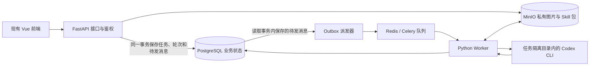

# Development Plan — 恒鑫智图

## 钉钉回调修复 · 2026-09-16

真实登录日志确认用户资料接口认证失败；修正专用令牌请求头，新增 unionId 到企业 userId 的应用凭据核验，管理员匹配只使用企业成员 ID；登录页展示回调错误类别。认证/会话测试 12 项通过，前端类型检查及构建通过；吴永杰的真实企业成员映射核验通过。已发布 VPS 修复镜像 callback-fix-20260916，线上前端产物匹配、配置接口正常、匿名请求仍为 401。独立审查尚未返回最终结论，实际用户重新授权仍待验证，不标记阶段验收完成。

## 退出登录修复 · 2026-09-16

补齐工作区顶部退出入口，调用现有服务端注销接口，清理前端身份后整页进入登录页；失败提示重试。前端 89 项测试、类型检查和构建通过，本地浏览器点击退出及刷新停留登录页已验证。本专项独立两阶段审查通过（LOGOUT-REVIEW.md），前端已同步 VPS 并备份旧产物。VPS 已关闭开发身份，匿名身份、任务、模板、用户管理接口返回 401，钉钉配置接口返回 200。当前本地后端仍保留开发身份且钉钉配置接口返回 404；真实钉钉认证不算本次已验收，使用 VPS HTTPS 域名继续验证。

## Phase 13 管理中心开发开始 · 2026-09-15

用户明确将钉钉通讯录用户搜索权限 `qyapi_addresslist_search` 后置配置。Phase 12.2 的真实双端登录仍等待该权限和两位初始管理员 userId 的解析，但不阻塞管理中心继续开发。

当前先交付 **13.1 调用统计真实接口**：把 Phase 9 已采集的执行轮次、实际操作者、结果版本和 CLI usage 接入 `/management/usage`，按上海时间自然日、个人/全员权限、日期/人员/处理类型筛选返回统计与明细；用数据库测试覆盖成功、部分失败、失败、进行中、缺失 usage、重复 usage 和越权查询。接口实现及相关测试已完成，当前保留独立代码审查门禁；通过后再进入 13.2 执行监控和 13.3 系统配置审计。

## Phase 11A 用户验收完成 · 2026-09-14

用户确认开发机真实 Codex CLI 的双任务并发 2 已测试通过，Phase 11A 的开发机联调进入完成状态。现有证据覆盖真实 Worker、两个独立 CLI 实例、会话与目录隔离、任务结果归属及并发执行；尺寸例外仍按既定记录保留，商品/文字 Skill 和生产容量验收不在本阶段范围内。

下一阶段进入 **Phase 12：钉钉双端登录与四角色**。开工先实现服务端会话、企业身份映射、待授权/禁用状态和角色管理，再接入钉钉电脑端免登与浏览器网页授权；真实双端验收依赖目标企业配置、HTTPS 回调域名和测试成员资料，凭据只放部署环境。

## 路由体验修复 · 2026-09-14

状态：专项修复完成。Node 24.18.1 下前端 85/85 测试、类型检查和构建通过，浏览器 mock 回归及独立 Stage 1/2 审查通过。证据见 `output/route-ux-validation.md`、`output/route-ux-fix-review.md`；仅覆盖本专项，不改变既有其他 Phase 的验收状态。

依据 Product-Spec 第 5 节本日修复确认，按以下顺序执行并独立验收：
1. 任务详情与 query 双向一致，列表条件随 URL 恢复；验收打开/切换/关闭/删除/刷新/前进后退及旧 taskId 链接。
2. 成品详情地址定位、归档后直达及成品回源；验收来源不可用仍保留归档下载、筛选恢复与清除。
3. 三类新建入口、准确的功能文案及可见无权限反馈；验收实际目标和提示一致。
4. 类型检查、单测、构建、浏览器功能验证与独立两阶段专项审查。未修改既有 Phase 12–14 进度，不宣称真实钉钉或全项目上线验收。

## 品牌接入任务 · 2026-09-14

依据 Product-Spec「品牌确认」及 Design-Brief「品牌标识定稿方向」，用户已确认采用恒鑫智图方案。本任务独立于既有 Phase 进度。

1. 固定设计与素材：归档认可稿，产出可编辑 SVG、文字转路径横版、透明 PNG、favicon 与应用图标。完成标准：资源可独立使用，颜色/轮廓一致，有使用说明和预览。
2. 接入既有品牌位置：共享 ArtLogo、系统名称、登录页、启动状态、页头及浏览器元信息。完成标准：使用「恒鑫智图」「前海恒鑫」「京东业务生图」，沿用原 Art 布局与业务主题。
3. 验证与独立审查：运行前端类型检查、单测及构建，在本地检查登录、侧栏展开/折叠、浅深背景和小尺寸标识。完成标准：证据明确区分本地预览与用户正在使用的服务，独立两阶段审查通过；不据此改变其他 Phase 的验收状态。

完成记录（2026-09-14）：三项已完成。资源包位于 `hengxin-smart-image/branding/恒鑫智图-品牌资源.zip`；前端类型检查通过、79/79 单测通过、最终构建通过，独立两阶段审查 PASS，日常 3008 开发服务已只读确认新品牌展示。证据见 [品牌验证](hengxin-smart-image/docs/BRAND-IDENTITY-VALIDATION.md) 与 [独立审查](hengxin-smart-image/docs/BRAND-IDENTITY-REVIEW.md)。本次未部署生产或改变既有 Phase 结论。

> 版本 v1.18 · 2026-09-16。依据 Product-Spec.md v0.21、Design-Brief.md 和用户认可的现有原型。
> 当前状态：Phase 1–11A 已验收；Phase 12.1 身份与会话地基、用户角色真实接口已实现并通过两阶段审查；Phase 12.2 钉钉双端授权开发已启动，真实联调等待 Q-008 配置，其中通讯录搜索权限由用户后置；Phase 13.1 调用统计真实接口开发中；Phase 14.1 VPS 开发测试环境已部署，真实壁纸 Skill 冒烟触发成功但因 Skill 尺寸报告失败，待后续治理。Phase11证据见 hengxin-smart-image/docs/PHASE11-VALIDATION.md；Phase11A见 hengxin-smart-image/docs/PHASE11A-CLOSEOUT-RESULTS.md。

## 1. 开发方向与已有成果

前端直接继承 `prototype/source/`，保留图片处理一级菜单及替换壁纸、替换商品、替换文字三个二级菜单，以及任务中心、模板库、成品库。当前页面是正式开发的视觉和交互基准。后端确定为 Python FastAPI + PostgreSQL，图片与 Skill 包存入 MinIO。四角色及钉钉双端接入详见 Product-Spec.md 第 13 节；钉钉电脑端和浏览器共用同一前端。设计与运营同权限已确认；主管查看全员任务及统计、模板免审批直接使用、全员查看/删除模板任务成品、编辑全员模板及返工/归档全员任务均已确认。

下表列出正式前端的当前状态及后端待接内容；前端源码路径相对于 `hengxin-smart-image/frontend/src/`，原型路径相对于仓库根目录。各阶段的“关键文件”是交付规划，未来文件尚未创建不算缺失。

| 已有内容 | 当前状态 | 后端阶段需要完成 |
|---|---|---|
| ArtSidebarMenu、ArtHeaderBar、ArtWorkTab、ArtPageContent、ArtTable、主题 | 已承接到正式前端 | 接入真实身份和授权 |
| `views/hengxin/components/CreateTask.vue` 及三个页面包装组件 | 上传、模板选择、表单和异常交互已通过前端验收 | 真实文件上传、模板加载和任务受理 |
| Templates.vue、Tasks.vue、TaskDetail.vue、Archive.vue | 分页、错误状态、图片版本和归档交互已完成 | 持久化业务接口与版本关联 |
| `views/hengxin/model.ts`、`api/hengxin/` | 已分离内存 mock 与 HTTP 适配，不再使用原型 localStorage 业务库 | 后端按契约接入；生产继续禁止回退模拟数据 |
| `views/auth/dingtalk-login.vue` 及管理页面 | 登录状态、四角色视图和管理交互已完成前端验证 | Phase 6 建可信开发身份，Phase 12/13 接真实认证、授权和管理接口 |
| `views/hengxin/download.ts` | 示例图片和 ZIP 下载已完成前端验证 | 授权文件下载与服务端 ZIP |
| `prototype/html/` | 保留只读视觉对照 | 不编辑压缩产物，不把其当源码 |

前端阶段已将原型源码承接到 `hengxin-smart-image/frontend/`；Phase 5 已建立 `hengxin-smart-image/backend/` 和 `hengxin-smart-image/infra/`；整个工程沿用当前根 Git 仓库。复制时排除 node_modules、dist、缓存、演示资料，重新按锁文件安装依赖。原型 node_modules 是指向参考项目的 junction，不能当普通目录递归复制。原型保持可供对照，正式前端成为唯一业务维护源。

## 2. 本机 Docker 检查及复用方案

2026-09-08 只读执行 docker ps、定向 inspect 和容器版本命令；没有读取或输出环境凭据，没有修改容器、数据库和存储桶。

| 实际容器 | 实际版本 / 状态 | 端口与持久化 |
|---|---|---|
| it-project-console-postgres-1 | PostgreSQL 16.15，healthy | 127.0.0.1:55432；it-project-console_postgres-data |
| it-project-console-minio-1 | RELEASE.2025-09-07T16-13-09Z，healthy | API 59000，控制台 59001，均绑定 127.0.0.1；it-project-console_minio-data |
| hengxin-smartmail-uat-api-1 | Python 3.12.10、FastAPI 0.139.2、SQLAlchemy 2.0.51、Pydantic 2.13.4、Uvicorn 0.35.0，healthy | 参考 API/Worker 分离方式 |
| hengxin-smartmail-uat-worker-1 等 | API 同源镜像，Celery 5.6.3 | 已有按队列拆 Worker 的先例，本项目初期只需一个生成 Worker |
| hengxin-smartmail-uat-redis-1 | 镜像 redis:8.8-alpine，healthy | Docker 内部 6379，无主机端口 |

配置参考：`D:/Work_Project/hengxin-devhub/it-project-console/compose.yaml`、`D:/Work_Project/hengxin-smartmail/infra/compose.yaml`。前者已固定镜像 digest、健康检查和命名卷，可沿用方式。

默认采用独立 Compose 项目 `hengxin-smart-image`，复用已缓存的镜像版本和配置模式；不复用其他业务的数据卷、库表、账号或 bucket。理由是各项目可独立启停、迁移和备份。若后续指定共用实例，则创建专用数据库、账号和私有 bucket 后连接，不混用业务数据。

本地计划端口：前端 3008、API 8008、PG 55433、MinIO 59002/59003；仅为分配方案，启动前检查占用。Redis 仅内部网络可见。3007 原型和 3006 参考项目继续用于对照。

## 3. 技术栈和执行架构

| 层级 | 选定技术与版本基线 | 依据 |
|---|---|---|
| 前端 | Vue 3.5.22、Element Plus 2.11.4、Vite 7.1.7、TypeScript 5.6.3 | 当前 pnpm-lock.yaml 的实际锁定版本；优先复用，不为规划升级主版本 |
| 前端运行与包管理 | Node.js 24 LTS、pnpm 10.x | Node 官方 LTS；已有 lockfileVersion 9。Phase 1 固定前端工具补丁版本 |
| API | Python 3.12、FastAPI 0.139.2、Pydantic 2.13.4、Uvicorn 0.35.0 | 本机已运行组合；用 uv 锁定依赖，不宣称这些都是最新版本 |
| 数据层 | PostgreSQL 16.15、SQLAlchemy 2.0.51、Alembic 1.x、psycopg 3.x | 优先匹配本机可用 PG 与 ORM；PG 16 仍受支持 |
| 存储 | MinIO RELEASE.2025-09-07T16-13-09Z，Python minio SDK 7.x | 匹配本机固定镜像 digest，使用标准对象 API |
| 后台执行 | Celery 5.6.3 + Redis 8.8-alpine | 复用现有 Python 项目技术路线；Redis 只承担消息，业务状态以 PG 为准 |
| AI 适配 | Linux Codex CLI 非交互执行，版本单独固定 | 通过适配层封装 CLI，具体二进制版本在 Phase 9 实机验证后锁定 |
| 部署 | Ubuntu 24.04 x86_64、Docker Compose、Nginx | 单机 API/Worker 分离，后续按资源实测扩执行进程 |

新依赖的补丁版本及镜像 digest 在对应阶段首次锁文件生成时固定并验证。现有版本为复用基线，不批量升级；开工和发布前检查兼容性与已知漏洞，必要修复升级需回归已有页面。

已确认异步执行：首次生成和返工接口完成校验、持久保存任务/轮次与 outbox 后返回 HTTP 202、任务 ID 和轮次 ID，不在请求中启动或等待 CLI。独立 Celery Worker 消费任务并分轮启动 CLI，完成后退出该 CLI 进程；FastAPI 和 Worker 服务常驻。仅使用 async def 或 Web 进程内后台协程不满足持久异步要求。前端先用轮询读取 PG 中的真实状态，默认执行中每 3 秒、其他状态每 10 秒，离开页面停止轮询。无可靠百分比时只展示排队、执行、收集结果等阶段。

Phase 3 前端阶段的轮询频率为任务列表每 4 秒、打开的详情每 3 秒，离开页面或关闭详情即停止；上述按执行状态采用 3/10 秒的策略在 Phase 8 接入真实后台状态时实现。

Worker 下载本轮输入与固定 Skill 版本到隔离目录，启动 CLI，收集并校验输出，上传 MinIO，最后提交 PG 图片版本。用对象键和校验和记录文件，数据库不保存永久预签名 URL；预览/下载经 API 校验权限后提供短期签名地址。

初始生成并发已确认从 1 起步，更高上限需实测后配置。20/100 是使用人数，不是 CLI 并发数；服务器基础资源已检查，带宽和负载容量未压测，不承诺容量。Phase9真实执行采用Linux原生Celery Worker和CLI，不能把Windows原生Worker测试当作Ubuntu验收。

会话规则（2026-09-09 已确认）：按业务任务分配，任务 A 首次生成和后续单张/整套返工均使用会话 A；同一运营创建任务 B 时新建会话 B。归档是后端操作，不调用 CLI。保留输入快照、会话 ID 与图片版本等基础记录，不引入复杂上下文管理。

### 3.1 会话生命周期与并发实施约束

业务规则以 Product-Spec 第 9.1–9.2 节为准。本次只规划实现，Phase 5 的短时测试队列不能直接作为真实 CLI 的并发保障。

- Phase 8 用 PG 事务、唯一约束与条件更新落实请求幂等、任务级执行互斥和轮次认领；业务锁只在短事务中持有，CLI/文件处理在事务外执行。多个 Worker 并发验证不能通过全局并发固定为 1 或 Python 线程锁替代。
- Phase 8 冻结内部执行状态与 API 操作资格，Phase 9 接入实际进程、执行代次/租约和不确定状态对账；租约过期不直接释放同任务执行权。核实旧执行停止及已有结果后，才允许按既定重试规则重新执行。
- Phase 9 保证执行环境不能跨任务读取或修改会话材料、输入、输出及临时文件，并将临时轮次输入/输出目录与持久会话材料分开，按任务映射明确 session ID；每轮进程结束退出，返工重新启动并续接原会话。需要返工的任务不使用 ephemeral 会话；原会话不能恢复时失败并保留旧结果。
- 取消、最终图片版本提交和当前版本切换共同校验任务/轮次有效性及当前认领凭证；删除或旧执行者的迟到结果不得写回。Phase 11 的回收不能清理运行中或仍可返工任务的会话材料，保留时长仍按 PRD 第 11 节管理。

早期隔离方案调研见 [Codex CLI 多任务并发与隔离评估](hengxin-smart-image/docs/CODEX-CLI-ISOLATION-ASSESSMENT.md)。Phase 9 已选用 Linux 原生 Worker 与受控 Bubblewrap，每任务独立持久 home、每轮独立 work/control；实际环境与实机证据见 [CODEX-EXECUTION.md](hengxin-smart-image/docs/CODEX-EXECUTION.md) 和 [PHASE9-VALIDATION.md](hengxin-smart-image/docs/PHASE9-VALIDATION.md)。每轮独立 Docker 容器属于早期研究建议，不能作为当前实现说明；任务之间必须隔离的已确认要求不变。

## 4. 业务默认方案与阶段入口

以下引用 PRD 第 11、13 节的阶段入口；标注已确认的事项不重复确认，其余具体建议保留未确认状态；进入相关阶段前集中确认对应一行，不能把本文建议当成用户已批准。工程骨架与接口约定可先进行。

| PRD 问题 | 计划采用的建议 | 进入阶段 |
|---|---|---|
| Q-001 上传规格 | 已确认 JPG/PNG/WebP，单文件 10 MiB，每组最多 20 张；模板输出数跟随有序模板图，文字输出数跟随输入图。建议不主动缩放；真实输出尺寸和格式兼容仍待联调 | 前端 Phase 2；后端 Phase 6/7 |
| Q-004 账号与权限 | 钉钉双端登录与四角色已确认；超管绑定成员角色；主管查看全员任务/统计，模板无需审批，全员查看/删除三类资源、编辑全员模板、返工和归档全员任务 | 前端 Phase 2–4 实现已确认规则；Phase 12 验证真实权限 |
| Q-002 Skill 管理 | 已确认仅超级管理员上传、安装、维护和启停；其他角色只绑定已发布版本。专用优先、未指定按模块默认解析，保存冻结版本；无可用版本存草稿已确认 | 前端 Phase 4；后端 Phase 7 |
| Q-008 钉钉配置 | 企业内部应用、可见范围、接口权限、HTTPS 域名/回调及初始超级管理员成员 userId 列表，见 PRD 第 13 节 | Phase 12；Phase 14 双端回归 |
| Q-003 文字输入 | 已确认：上传图片 + 自然语言修改要求，任务名称必填、SKU 可选，不增加排版编辑器 | 前端 Phase 2；后端 Phase 8 |
| Q-007 历史与归档 | 同任务整套/单张返工互斥已确认；旧版本保留、单张下载和整套 ZIP、全套完整后归档不可变快照及相同版本归档幂等仍按建议默认管理 | 前端 Phase 3；后端 Phase 10/11 |
| Q-004 删除保留 | 已确认删除失效执行且保护历史引用；回收站形式、30 天回收及临时素材清理时限仍是待确认建议 | Phase 11 |
| Q-005 服务器资源 | 部署前采集硬件及剩余空间；建议从并发 1 起步压测，实际运行上限待确认，不按用户人数猜算 | Phase 14 |
| Q-006 CLI 身份和运行限制 | 已确认 codex 专用身份、并发 1、单轮 60 分钟硬超时、自动重跑 0；记录可用 usage，账号预算仍需设置 | Phase 9/13/14 |

尚无三个真实 Skill 不阻塞 Phase 1–8 和使用测试执行器的平台功能；Phase 9 的 CLI 传输实测需要可用 CLI 认证，Phase 14 的真实业务验收需要三个 Skill 及其工具依赖。模拟输出始终标识为测试，生产配置禁止选择模拟执行器。图片效果评测、Skill 编写不在本计划工作量中。

## 5. 阶段总览与依赖

先完成前端，再开发后端；前端各组完成即交付可浏览预览，不等到全部完成才展示。下列前四阶段不创建后端应用、数据库迁移或服务容器。先定义前端数据契约不等于开发后端。

| 阶段 | 交付结果 | 依赖 | 状态 |
|---|---|---|---|
| Phase 1 前端承接 | 原有布局、组件、路由及模拟接口契约 | 原型源码 | 已完成 |
| Phase 2 创建与模板页面 | 三类处理、素材交互和模板维护 | 1 | 已验收 |
| Phase 3 任务与成品页面 | 任务详情、返工、版本、下载及归档交互 | 2 | 已验收 |
| Phase 4 管理及登录页面 | 五个管理页面、四角色视图、登录状态；全部前端验收 | 3 | 已验收 |
| Phase 5 后端基础 | FastAPI、PG、MinIO、Redis、Worker/outbox | 4 | 已验收（用户授权继续 Phase 6） |
| Phase 6 文件与用户归属 | 真实上传下载及后端测试身份 | 5 | 已验收 |
| Phase 7 模板与 Skill | 模板持久化、Skill 版本及安装 | 6 | 已验收（用户授权继续 Phase 8） |
| Phase 8 任务与队列 | 真实异步提交、任务状态 | 7 | 已验收（用户授权继续） |
| Phase 9 Codex 执行 | 独立会话、结果回传及调用记录 | 8 + CLI 环境 | 已验收（用户授权继续） |
| Phase 10 返工 | 同会话整套/单张修改、版本持久化 | 8；真实执行依赖 9 | 已验收（用户授权继续 Phase 11） |
| Phase 11 归档 | 真实下载、快照与生命周期 | 10 | 技术验证与独立两阶段审查通过，待用户验收 |
| Phase 11A 开发机 CLI 真实联调 | 开发机真实生成、会话返工、归档及双任务并行验证 | 9–11 + 本机 CLI 认证/隔离环境 + 实际业务 Skill | 真实验收、656项后端回归与独立两阶段审查通过，待用户验收 |
| Phase 12 钉钉与权限 | 12.1 身份会话与用户角色接口；12.2 双端认证、真实授权及业务回归 | 6–11、11A + 钉钉应用 | 12.1 审查通过，12.2 待 Q-008 |
| Phase 13 管理接口 | 真实统计、监控、配置及页面联调 | 9、12 | 未开始 |
| Phase 14 联调部署 | 三种真实 Skill 闭环及 Ubuntu 上线验收 | 11–13 + 真实 Skill | 14.1 VPS 已部署；真实 Skill 冒烟待治理后复验 |

主线 1 → 2 → 3 → 4 → 5 → 6 → 7 → 8 → 9 → 10 → 11 → 11A → 12 → 13 → 14。前端完成以页面、交互和状态验收为准；真实生成、存储、服务端权限和监控仍须后端阶段逐项验收。CLI 环境未就绪时，10/11 可使用测试执行器推进，但不能标为真实业务完成。

所有路径相对于仓库根目录；以下均为计划创建或承接的文件。

## Phase 1：前端工程承接与接口契约

执行拆分（2026-09-09）：
1. 工程承接：排除依赖 junction、构建产物和实际环境文件，复制源码及许可；固定本机 Node/pnpm，独立安装通过。
2. 服务边界：提取契约类型，集中模拟种子、状态与计时器，页面通过服务调用读写；原型存储不迁入正式工程。
3. 模式隔离：模拟预览明确标识，真实模式不导入演示身份或回退模拟数据，断连可重试。
4. 验收：独立审查、服务边界测试、严格类型检查、生产构建与浏览器主流程/故障回归；记录证据并交付预览。

**交付内容**：
- 将现有原型源码承接为正式前端，保留 art-design-pro 布局、组件库、主题及已认可导航，不删现有可复用组件。
- 定义用户、文件、模板、Skill、任务、轮次、图片版本、归档和管理数据类型，以及分页、错误、受理 ID 和状态契约。
- 把模拟接口集中隔离，页面通过同一服务接口访问；本地预览明确标识模拟数据，正式模式不自动退回模拟数据。

**关键文件**：
- `hengxin-smart-image/frontend/src/main.ts`、`hengxin-smart-image/frontend/src/router/modules/index.ts`：入口和导航承接。
- `hengxin-smart-image/frontend/src/types/hengxin.ts`、`hengxin-smart-image/frontend/src/api/hengxin/client.ts`：数据类型与服务边界。
- `hengxin-smart-image/frontend/src/api/hengxin/mock.ts`、`hengxin-smart-image/frontend/src/views/hengxin/model.ts`：集中模拟适配与旧模拟层迁移。
- `hengxin-smart-image/docs/API-CONTRACT.md`：接口字段、状态及错误约定，后端阶段按此实现并核对 OpenAPI。

**验收标准**：不启动后端即可运行前端；页面布局与认可原型一致，组件保留；干净安装、类型检查、生产构建通过；模拟模式明确可识别，真实模式断连显示错误。交付首个前端预览地址，原型仍可对照。

Phase 1 验证记录：`hengxin-smart-image/docs/PHASE1-VALIDATION.md`；两阶段审查均 PASS，见 `PHASE1-REVIEW.md`。前端预览 `http://127.0.0.1:3008/`。继承依赖审计风险列为上线前整改，本阶段不作可发布声明。

## Phase 2：三类图片处理与模板库前端

执行拆分与完成标准（2026-09-09）：
1. 服务契约：独立模板分页、可用 Skill 目录、素材上传适配；版本绑定、文件引用和失败场景可测试，真实模式无模拟回退。
2. 三类创建页：统一素材预览/校验/移除/失败重试；名称、SKU、自然语言与模板/Skill 正确传递，提交期间不可重复操作，空态和加载错误可恢复。
3. 模板库：分页搜索与排序、创建编辑、图片排序、版本展示、仅绑定可用 Skill，无 Skill 可存草稿、保存失败保留输入，全员删除有确认，历史任务快照不变。
4. 交付：两阶段独立审查、服务与故障测试、严格类型及生产构建、浏览器主流程和视觉回归。

**交付内容**：
- 完成替换壁纸、替换商品、替换文字独立入口的表单、选模板、本地素材选择/预览/移除及提交交互。
- 完成模板创建、编辑、搜索、排序、版本展示、绑定可用 Skill 及无 Skill 草稿状态；保存后直接可用，无主管发布入口；全员可查看和删除模板。
- 覆盖空状态、校验失败、提交中、模拟上传失败及重试；遵循 PRD 建议状态，不把待确认细则升级为定案。

**关键文件**：
- `hengxin-smart-image/frontend/src/views/hengxin/components/CreateTask.vue`、`hengxin-smart-image/frontend/src/views/hengxin/components/Templates.vue`。
- `hengxin-smart-image/frontend/src/api/templates.ts`、`hengxin-smart-image/frontend/src/api/skills.ts`、`hengxin-smart-image/frontend/src/api/files.ts`：对接统一模拟服务与契约。

**验收标准**：三个入口和模板操作可完整演示；文字不强制模板，类型绑定正确，重复提交有保护；素材可本地预览，模拟上传不声称已存入 MinIO。类型检查、构建及浏览器交互通过，交付可浏览页面。

## Phase 3：任务、返工与成品库前端

执行拆分（2026-09-09）：1. 任务分页/详情/删除与可靠状态；2. 有序结果槽、轮次和历史版本，串行返工失败保留旧图；3. 成品分页/预览/删除、快照归档及单图/整套下载；4. 独立审查、服务与浏览器故障测试、严格类型和构建、Art 视觉核对。完成标准以本节验收标准及 PHASE3-VALIDATION 为准。

**交付内容**：
- 完成全员可查看的任务列表、筛选、详情、删除及图片预览，覆盖排队/执行/成功/部分失败/失败各状态。
- 完成整套和单张意见、返工状态、历史版本切换；通过模拟场景演示失败保留旧结果。
- 完成单图与整套下载入口、归档及全员成品搜索/预览/删除；演示下载使用示例文件，不标为真实生成结果。

**关键文件**：
- `hengxin-smart-image/frontend/src/views/hengxin/components/Tasks.vue`、`hengxin-smart-image/frontend/src/views/hengxin/components/TaskDetail.vue`、`hengxin-smart-image/frontend/src/views/hengxin/components/Archive.vue`。
- `hengxin-smart-image/frontend/src/api/tasks.ts`、`hengxin-smart-image/frontend/src/api/revisions.ts`、`hengxin-smart-image/frontend/src/api/archives.ts`、`hengxin-smart-image/frontend/src/views/hengxin/download.ts`。

**验收标准**：模拟完成创建→结果→单张/整套返工→下载→归档全流程；单图返工显示仅目标图变化，失败保持旧图，部分失败不可整套归档；类型检查、构建、浏览器交互通过并交付预览。实际异步持久化与 CLI 会话留待后端验证。

## Phase 4：管理中心、角色视图与登录页面

执行拆分：1. 独立管理接口、类型守卫及模拟权限/故障，完成标准为四角色范围和参数校验可测试；2. 钉钉登录状态与角色菜单，完成标准为匿名/失效/待授权/禁用均不能进入业务，模拟角色切换不泄漏到真实模式；3. 五个管理页面，完成标准为查询、编辑、失败重试、安装状态及审计有可用交互；4. 独立两阶段审查、全量测试与构建、隔离浏览器角色/故障及旧流程回归、视觉对照。建议默认仅用于前端预览，真实授权/配置上限在后端阶段落实。

2026-09-09 权限确认：四角色均可编辑全员模板、返工及归档全员任务，保留实际操作者；Phase 4 前端及 Phase 12 后端跨创建人验收同步采用此规则，其他管理权限不变。

**交付内容**：
- 基于原 Art 组件完成调用统计、执行监控、用户与角色、Skill 管理、系统配置五个页面及异常/空状态。
- 通过仅模拟模式可用的角色预览验证四角色菜单和操作视图，设计与运营一致，Skill 维护仅超级管理员可见；不把前端隐藏入口当服务端授权。
- 完成钉钉登录入口、授权中/失败/过期/待授权状态，先模拟状态，不接真实 SDK 或授权码交换。
- 整体走查全部前端页面，修复交互及视觉问题；统一接口契约与模拟场景，记录前端验收结果后进入后端阶段。

**关键文件**：
- `hengxin-smart-image/frontend/src/views/hengxin/admin/usage.vue`、`hengxin-smart-image/frontend/src/views/hengxin/admin/monitor.vue`、`hengxin-smart-image/frontend/src/views/hengxin/admin/users.vue`。
- `hengxin-smart-image/frontend/src/views/hengxin/admin/skills.vue`、`hengxin-smart-image/frontend/src/views/hengxin/admin/settings.vue`。
- `hengxin-smart-image/frontend/src/views/auth/dingtalk-login.vue`、`hengxin-smart-image/frontend/src/api/auth.ts`、`hengxin-smart-image/frontend/src/api/management.ts`。

**验收标准**：PRD 第 5 节全部页面及状态有前端演示；四角色视图符合已确认规则；统计/健康明确模拟，usage 缺失和空闲分别表达；无后台服务也能体验完整前端。类型检查、构建、浏览器流程和视觉对照通过，交付完整预览。钉钉双端实机认证与容器兼容性在 Phase 12/14 验收。

后端阶段涉及的前端文件均为接入真实接口和回归已有页面，不重新制作布局和交互。

## Phase 5：后端基础工程与契约落地

**交付内容**：
- 在全部前端完成后搭建后端；按 Phase 1–4 的接口契约实现响应结构，核对 OpenAPI 与前端类型，保留已有页面。
- 建立 FastAPI 应用、环境配置、OpenAPI 契约、数据库迁移入口和 MinIO 连通探针；规划接口 `/api/v1`。
- 建立独立 Compose 与锁文件，沿用现有镜像固定和健康检查方式；PG、Redis、MinIO 采用新命名卷。同步建立 Celery Worker 与通用 outbox 基础，以支持 Phase 7 的异步 Skill 安装。

**关键文件**：
- `hengxin-smart-image/frontend/src/main.ts`、`hengxin-smart-image/frontend/src/router/modules/index.ts`：核对已有入口和接口配置。
- `hengxin-smart-image/frontend/src/views/hengxin/model.ts`：准备切换已有模拟/真实服务适配。
- `hengxin-smart-image/backend/app/main.py`、`hengxin-smart-image/backend/app/core/config.py`、`hengxin-smart-image/backend/app/db/session.py`：应用、配置和数据库连接。
- `hengxin-smart-image/backend/app/worker/celery_app.py`、`hengxin-smart-image/backend/app/worker/outbox.py`：通用队列与可靠派发基础。
- `hengxin-smart-image/infra/compose.yaml`、`hengxin-smart-image/docs/API-CONTRACT.md`：服务组合与错误/分页/幂等契约。

**验收标准**：干净依赖安装、前端构建、后端启动及健康检查通过；已有前端页面无回归；3007 原型仍可访问，其他项目卷不被挂载。通用测试作业完成持久派发、Worker 执行及重复投递保护；本阶段不把演示生成算作正式能力。

## Phase 6：文件存储与用户归属基础

**交付内容**：
- 建立用户表、统一当前操作者接口和基础权限策略，资源与操作记录使用稳定用户 ID（用于归属和审计，不限制已确认的全员查看/删除）；本地开发通过服务端配置固定测试身份联调，自动化测试可注入四角色身份。
- 实现素材上传、服务端解码校验、文件元数据入库、MinIO 私有对象与受控预览下载；建立共用逻辑删除记录，供模板/任务/成品阶段使用；上传失败保留表单可重试。
- 开发身份仅限本地开发配置，前端不传可信角色或任意用户 ID；生产配置启用开发身份时启动失败。Phase 12 再接真实钉钉身份及已有角色管理页面的接口。

**关键文件**：
- `hengxin-smart-image/backend/app/modules/auth/dependencies.py`、`hengxin-smart-image/backend/app/modules/auth/permissions.py`：当前操作者接口及基础权限策略。
- `hengxin-smart-image/backend/app/modules/auth/dev_identity.py`：受环境限制的固定测试身份。
- `hengxin-smart-image/backend/app/modules/files/deletions.py`：共用逻辑删除记录及操作者留痕。
- `hengxin-smart-image/backend/app/modules/files/router.py`、`hengxin-smart-image/backend/app/storage/minio_store.py`：文件入口、所有者记录和对象存储。
- `hengxin-smart-image/frontend/src/api/auth.ts`、`hengxin-smart-image/frontend/src/api/files.ts`、`hengxin-smart-image/frontend/src/views/hengxin/components/CreateTask.vue`：开发身份接口及真实上传。

**验收标准**：损坏/超限图片拒绝，刷新和重启后素材仍在；文件及操作留存测试用户归属；不接受客户端伪造身份；生产启用开发身份时拒绝启动。通过身份注入测试基础角色规则和跨用户共享资源访问（有效用户可访问，匿名/禁用账号拒绝），前后端编译、迁移及上传下载通过。本阶段不要求钉钉配置，不将测试身份算作真实登录验收。

## Phase 7：模板与 Skill 版本管理

2026-09-09交付：模板与Skill真实接口、版本历史、模块默认、Linux安装和通用队列已接入；后端108项/前端41项测试、类型编译、构建、隔离API/Worker/浏览器和旧队列回归通过。真实业务Skill及图片生成仍属于后续。执行拆分及审查闭环见docs/PHASE7-PLAN.md、PHASE7-REVIEW.md、PHASE7-VALIDATION.md。

**交付内容**：
- 实现模板创建、搜索、排序、编辑、停用、全员逻辑删除及历史版本；保存后直接可用，无审批发布步骤；无 Skill 时可保存草稿。
- 仅超级管理员可上传、安装、更新、启停 Skill 和配置模块默认绑定；其他角色只选已发布版本。异步安装区分上传成功/安装中/可用/失败，安装失败保留旧版，历史任务冻结版本。
- 为安装与后续生成扩展通用作业类型、路由及成功/失败/取消终态；结束的作业停止 outbox 重派，健康运行中的作业不持续堆积重复消息，消息补发与再次执行业务分开记录。
- 保存模板时生成版本并冻结图片顺序，满足条件即成为可用版本；模板更新不改变旧任务引用，不增加审批发布步骤。

**关键文件**：
- `hengxin-smart-image/backend/app/modules/templates/router.py`、`hengxin-smart-image/backend/app/modules/templates/service.py`：模板与版本。
- `hengxin-smart-image/backend/app/modules/skills/router.py`、`hengxin-smart-image/backend/app/modules/skills/package_validator.py`：Skill 管理、ZIP 路径/大小/元数据校验。
- `hengxin-smart-image/backend/app/worker/skill_install.py`：超级管理员触发的异步版本安装和状态记录。
- `hengxin-smart-image/backend/app/models.py`、`hengxin-smart-image/backend/app/worker/outbox.py`、`hengxin-smart-image/backend/migrations/versions/`：将 Phase 5 测试作业关联扩为通用作业类型及终态，保持迁移可回归。
- `hengxin-smart-image/frontend/src/api/templates.ts`、`hengxin-smart-image/frontend/src/api/skills.ts`：业务接口。
- `hengxin-smart-image/frontend/src/views/hengxin/components/Templates.vue`、`hengxin-smart-image/frontend/src/views/hengxin/admin/skills.vue`：模板现有交互与管理表单。

**验收标准**：本阶段通过注入测试身份验证权限，Phase 12 再以真实登录回归：设计主管、设计和运营直接调用 Skill 包上传/安装/启停接口均被拒绝（模板图片上传允许）；管理员异步安装失败不影响旧版；不同类型只能绑定匹配 Skill；缺失可用 Skill 不可提交生成；四角色均能查看和逻辑删除他人模板，保存后无需审批即可选用；删除记录实际操作者；模板 t1 的新版本不更改旧引用；解压拒绝越界路径、符号链接及超限包。构建、迁移和模板浏览器主流程通过。不在此阶段制作业务 Skill。

队列增补验收：安装任务路由正确，成功、永久失败和已完成取消均停止重派；有效认领期间不会持续产生重复消息，Redis 故障后未完成的有效作业仍可恢复。

## Phase 8：任务提交、持久队列与状态

执行拆分及工程边界见 hengxin-smart-image/docs/PHASE8-PLAN.md。仅显式test环境启用fixture结果；本地development无真实执行器时清楚返回503，Phase9再接真实CLI。

**交付内容**：
- 建立供 fixture 和真实 CLI 共用的图片版本及结果持久化模型，再将三个独立入口接入真实任务 API，冻结模板/Skill/素材/要求快照；文字入口不强制套图模板。
- 复用 Phase 5 的 Celery、Redis 和 Phase 7 扩展的通用 PG 事务 outbox 接入生成任务；同事务保存幂等请求、任务/轮次、执行占用和待发消息，数据库保证同任务只有一个未结束轮次，重复消息只允许一个 Worker 原子认领。
- 接入全员任务分页、筛选、详情、逻辑删除与轮询状态；测试环境使用显式 fixture 执行器证明队列闭环。
- 接入持久取消意图、执行状态待核实及操作资格契约，失效认领不能提交版本。前端显示服务端返回的可返工/可重试能力与原因，不只根据“失败”状态开放重试；字段见 API-CONTRACT 并发安全补充。

**关键文件**：
- `hengxin-smart-image/backend/app/modules/tasks/router.py`、`hengxin-smart-image/backend/app/modules/tasks/service.py`：提交及快照。
- `hengxin-smart-image/backend/app/modules/tasks/idempotency.py`、`hengxin-smart-image/backend/app/modules/tasks/claims.py`、`hengxin-smart-image/backend/app/modules/tasks/cancellations.py`：幂等请求、任务级占用、轮次认领、取消及失效条件。
- `hengxin-smart-image/backend/app/worker/celery_app.py`、`hengxin-smart-image/backend/app/worker/jobs.py`、`hengxin-smart-image/backend/app/worker/outbox.py`：消息及认领。
- `hengxin-smart-image/backend/app/modules/tasks/results.py`：通用图片版本及持久化结果入口。
- `hengxin-smart-image/backend/app/execution/fixture_runner.py`：仅测试的确定性执行器。
- `hengxin-smart-image/frontend/src/api/tasks.ts`、`hengxin-smart-image/frontend/src/views/hengxin/components/CreateTask.vue`、`hengxin-smart-image/frontend/src/views/hengxin/components/Tasks.vue`：提交及真实状态。
- `hengxin-smart-image/frontend/src/types/hengxin.ts`、`hengxin-smart-image/frontend/src/api/hengxin/validate.ts`、`hengxin-smart-image/backend/app/contracts/business.py`、`hengxin-smart-image/frontend/src/views/hengxin/components/TaskDetail.vue`：幂等与操作资格契约、响应校验、忙碌/待核实提示，适配已完成前端。

**验收标准**：四角色均能查看和逻辑删除他人任务并留存操作者；重复提交同一请求只有一条任务；并发限额 1 时第二条排队；关闭页面不终止后台任务；Redis 短暂不可用不丢已入库任务；重复消息不能重复发布结果。使用尚未结束的受控作业验证提交已返回 202 和任务 ID，状态可独立查询；Web 请求不得等待作业结束。fixture 明确展示测试来源。前后端编译、迁移和队列故障验证通过。

并发增补验收：按 PRD AC-010、021–023、025，用并发 HTTP 请求和两个独立 Worker 验证同键重放、同键异内容、同任务不同新请求互斥、重复消息单次启动、取消和旧结果屏障；Phase 8 使用受控执行器及内部轮次服务，Phase 10 再验证用户返工入口。任务执行期间可查询状态和写取消意图；状态待核实时不允许新执行。不得以单 Worker 或内存锁替代多进程争用验证。

## Phase 9：Codex CLI 独立会话与输出接入

2026-09-10 用户授权实施；执行身份沿用专用 codex，生成并发1，单轮硬上限60分钟，失败不自动重跑。CLI实测版本0.153.4。详细方案及证据见 docs/PHASE9-PLAN.md（位于项目代码子目录）。

**交付内容**：
- 建立 runner 适配层，下载冻结输入及指定 Skill 版本到每任务/轮次独立目录，以参数数组和 stdin 调用 CLI；不拼接用户内容为 shell 命令。
- 解析 JSONL 事件并保存明确会话 ID 及任务唯一关联；新业务任务新会话，返工只按记录的 ID 续接，禁止使用共享的 `--last`。临时轮次目录与受保护的持久会话存储分开，每轮进程退出不删除会话材料，不使用 ephemeral 模式。会话不可恢复时明确失败并保留旧结果；第一期不实现自动重建会话、上下文摘要或历史要求整理。
- 校验输出清单、图片解码、模板 slot 对应关系和目录边界，上传 MinIO 后落库；实现超时终止、进程退出与不确定状态对账。
- 记录每次实际 CLI attempt、操作者、轮次、耗时及可用 usage（去重且缺失为 null），采集 Worker 心跳、依赖健康和检查时间，供 Phase 13 使用。

**关键文件**：
- `hengxin-smart-image/backend/app/execution/codex_runner.py`、`hengxin-smart-image/backend/app/execution/workspace.py`：进程和任务目录。
- `hengxin-smart-image/backend/app/execution/events.py`、`hengxin-smart-image/backend/app/execution/output_collector.py`：事件、结果清单和图片校验。
- `hengxin-smart-image/backend/app/worker/reconcile.py`：重启恢复、租约和过期轮次写入屏障。
- `hengxin-smart-image/backend/app/worker/health.py`：执行端状态采集。
- `hengxin-smart-image/backend/app/modules/tasks/attempts.py`：每次实际 CLI 执行事实及 usage 去重。
- `hengxin-smart-image/infra/hengxin-worker.service.example`、`hengxin-smart-image/docs/CODEX-EXECUTION.md`：Linux 原生Worker与外层Bubblewrap任务隔离、固定CLI版本及实机证据；API/PG/Redis/MinIO保持Compose部署。
- `hengxin-smart-image/infra/compose.yaml`：配置独立会话持久存储及临时轮次空间，记录固定 CLI 版本恢复所需的最小材料；禁止通过共享可写会话目录绕过任务隔离。

**验收标准**：在 Linux 上用已知测试图片执行无效果要求的传输冒烟；两任务会话 ID 不同，分别验证读取和修改另一任务材料均被拒绝；无文件的文本成功不能标图片成功；越界输出拒绝；超时停止整个进程组；重启后不盲目重跑可能已收费的轮次。保留 CLI 版本、认证状态结果及事件证据，不记录凭据。真实三类 Skill 效果不作为此阶段验收。

生命周期与恢复增补验收：PRD AC-015、021–025 要保留实际 CLI 证据；每轮结束后进程退出，空闲期间不挂起等待用户，Worker 容器重建后能在新轮次目录续接原会话。模拟 CLI 已启动/输出已落盘但 PG 未提交时失联，重复消息、租约过期和人工点击均不能绕过待核实门禁；确认旧进程停止后才能处理恢复或重试。验证排队删除、运行删除、上传后提交前删除及旧执行者迟到，图片当前版本和既有快照引用不被覆盖。此处通过内部轮次服务进行无效果要求的传输/续接冒烟，用户返工入口在 Phase 10、归档完整流程在 Phase 11 回归，真实 Skill 效果验收仍在 Phase 14。

长任务需配置 Redis visibility timeout 高于运行硬上限及收尾时间并留余量，仍以 PG 认领/租约防重复；队列重投不等于再次启动 CLI，不能直接沿用 Phase 5 的 60 秒测试值。执行进程只访问本轮目录及本任务必要会话材料，不授予其他任务文件的读写权限，不挂载其他项目卷、Docker socket 或全局宿主目录；认证和运行工具按最小需要配置。Skill 指定与包隔离可校验，但不能把模型文本中的“已调用”当作真实产出证据。

## Phase 10：整套与单张返工

**交付内容**：
- 接入整套预览、单图查看、修改意见、执行轮次及历史版本展示，沿用当前详情页。
- 返工复用 Phase 8 的幂等、任务执行占用和轮次认领，同任务跨用户的整套/单张/重试请求互斥；固定目标 slot 与输入快照，仅有效执行的新结果成功后切换对应图片当前版本。
- 返工同样通过持久队列异步执行，提交返回 202、任务 ID 与轮次 ID，Worker 按原会话 ID 续接。
- 保留失败前旧结果；部分失败可预览已成功图片，整套与单张修改冲突返回明确提示。

**关键文件**：
- `hengxin-smart-image/backend/app/modules/revisions/router.py`、`hengxin-smart-image/backend/app/modules/revisions/service.py`：意见、目标范围和版本事务。
- `hengxin-smart-image/backend/app/modules/tasks/results.py`：结果汇总与部分失败。
- `hengxin-smart-image/frontend/src/api/revisions.ts`、`hengxin-smart-image/frontend/src/views/hengxin/components/TaskDetail.vue`：版本和反馈界面。

**验收标准**：第 N 张返工成功只改变该图的当前版本，其他图对象键及校验和相同；失败保持原图；整套反馈可追溯；连续双击不重复建轮次。返工作业未结束时提交已返回受理标识；关闭页面后继续运行；首次生成和返工会话 ID 一致。fixture 可验证平台状态，实际 CLI 返工证据在 Phase 14 补齐；构建和迁移通过。

多人返工增补验收：按 PRD AC-021，两个不同用户同时提交整套与单张返工只有一个 202，其余新请求返回 409 并保留意见；同一已受理请求的幂等重放返回原标识。排队、运行、收集结果、取消处理及待核实期间均不能另开轮次；跨用户操作记录真实操作者，不能按用户分别加锁而放过同任务争用。

## Phase 11：下载、成品归档与生命周期

2026-09-10 开始实施（用户授权继续）。执行拆分：T11-1 授权单图与服务端流式 ZIP，验收文件内容、鉴权与资源释放；T11-2 归档快照、幂等事务与成品库接入，验收返工不覆盖、搜索筛选及跨用户操作审计；T11-3 引用保护与默认禁用的清理入口，验收运行/可返工会话保护及显式策略下的清理。沿用本节完整套图归档验收规则；保留期限仍未确认，不自动启用回收。最后完成独立审查、全套测试、编译迁移和浏览器闭环。

**交付内容**：
- 实现单张授权下载和服务端流式 ZIP，沿用前端入口；大文件打包避免一次全部读入内存。
- 建立归档快照，接入成品库搜索、筛选、预览和下载；后续返工不覆盖归档对象。
- 实现幂等归档、逻辑删除与引用保护清理；删除模板/任务/归档不连带破坏仍被使用的对象。
- 会话材料清理与任务生命周期关联：只回收按已确认策略可清理、无有效执行且不再支持返工的任务材料；归档操作不直接清理会话，回收与执行/续接竞争时保护有效任务。保留天数不沿用未确认建议自动生效。

**关键文件**：
- `hengxin-smart-image/backend/app/modules/archives/router.py`、`hengxin-smart-image/backend/app/modules/archives/service.py`：归档事务与筛选。
- `hengxin-smart-image/backend/app/modules/files/downloads.py`、`hengxin-smart-image/backend/app/worker/cleanup.py`：ZIP 和垃圾回收。
- `hengxin-smart-image/frontend/src/api/archives.ts`、`hengxin-smart-image/frontend/src/views/hengxin/components/Archive.vue`、`hengxin-smart-image/frontend/src/views/hengxin/download.ts`：成品及下载接入。

**验收标准**：归档后返工，旧归档对象校验和不变；重复点击不增记录；部分失败不能整套归档；移除归档不误删任务文件；四角色均可删除他人归档，删除记录实际操作者且保留引用保护；下载鉴权与 ZIP 内容数量/格式一致；清理与续接同时发生时不删除仍可返工或正在执行的会话材料，保留策略未确认前不启用会话自动清理；构建、迁移及浏览器闭环通过。

## Phase 11A：开发机 Codex CLI 真实联调

**当前日常开发环境（2026-09-11 用户实测后调整）**：`hx-local-test` 已显式启用并发2，实时 Worker 两个消费者及 API/Outbox 配置已核对。此前验收结束“恢复1”是历史状态；通用默认值1和独立验收环境清理规则不变。详见 [本机配置与运行证据](hengxin-smart-image/docs/LOCAL-CODEX-DEVELOPMENT.md)。

**用户确认的本阶段例外（2026-09-11）**：暂时跳过原生输出1254×1254与模板800×800不一致的问题。后续专用联调任务明确豁免像素尺寸一致性，使用真实原生输出继续验证其他链路；不修改既有失败任务、不将未验证项目标为通过、不改变上传Skill或生产规则。下列串行闭环及Skill执行验收按此尺寸例外执行，其余要求保持不变。

2026-09-11 新增，依据 PRD 第 8.3 节。技术验收和独立两阶段审查已通过：Ubuntu 24.04 WSL、CLI 0.153.4、实际壁纸 Skill 1.0.1 完成双图生成、同会话单张/整套返工、重启续接、历史归档和浏览器 ZIP；两个真实任务并行、跨目录隔离、Worker 中断待核实/恢复、重投不重跑、早期取消和超时均有证据。后端最终656项通过、前端79项与构建通过；独立环境已清理，正常开发环境保持并发1。结果见 [PHASE11A-CLOSEOUT-RESULTS.md](hengxin-smart-image/docs/PHASE11A-CLOSEOUT-RESULTS.md)，审查见 [PHASE11A-CLOSEOUT-FINAL-REVIEW.md](hengxin-smart-image/docs/PHASE11A-CLOSEOUT-FINAL-REVIEW.md)。历史网络失败记录保留于 [PHASE11A-VALIDATION.md](hengxin-smart-image/docs/PHASE11A-VALIDATION.md)。待用户验收；商品/文字 Skill 未提供仍留 Phase14。本阶段先于 Phase12，不替代生产部署验收。

**交付内容与执行顺序**：

1. **检查开发机执行条件**：核对 CLI 可执行路径、实际版本、认证状态及真实图像工具；检查已上传壁纸 Skill 的包格式、版本与工具依赖。核对当前 Windows 主机的 WSL/Linux、Bubblewrap、目录隔离及与本机 API/数据库/存储的网络连通性。优先复用现有 Linux 适配器；若只有 Windows 原生 CLI，列清隔离和进程管理适配范围并完成等价验证后才启用。输出检查结果，不复制开发者完整 CODEX_HOME，也不输出凭据。
2. **建立可重复启停的真实测试环境**：配置开发机专用 Worker、认证引用、唯一节点名及任务执行目录，明确与容器网络的连接地址。新真实测试环境关闭 fixture；暂停相同队列上的 fixture 消费者或使用独立队列/环境。保留现有测试数据与原执行来源，提供启动、健康检查、停止及回到 fixture 环境的方法；真实执行不可用时明确报错，不静默降级。
3. **用实际素材验证完整业务流程**：以已上传 ecommerce-wallpaper-swap 包和用户提供的模板/素材创建新的 cli 任务，验证真实输出；继续整套与单张返工、历史版本、单图/ZIP 下载及归档后再返工。商品和文字的真实 Skill 具备时按同样流程补测，未提供者在报告中明确列为未验证，留给 Phase 14 完成。不得将既有测试结果改标为 cli。
4. **验证实例管理与双任务并行**：串行闭环通过后，在专用测试配置将生成上限设为 2、提供至少两个执行槽；提交两个不同任务并记录真实 CLI 运行时间重叠、不同 PID/会话/目录和正确图片归属。覆盖同任务返工争用、消息重投、执行超时/取消及 Worker 中断后的待核实保护；恢复时不重复调用可能已计费的轮次。记录 CPU、内存、耗时、错误及可用 usage，测试结束恢复默认并发 1。
5. **整理可复验交付**：补充自动化验证入口与运行说明，完成相关回归、编译、独立两阶段审查和浏览器验收；报告分别列平台通过项、实际 Skill 测试范围、真实并行结果和剩余限制，交用户验收。

**关键文件（按检查结果创建或修改）**：

- `hengxin-smart-image/infra/start_local_codex.ps1`：开发机启动、就绪检查及显式停止入口；使用既定本机运行环境，不隐式安装系统组件。
- `hengxin-smart-image/infra/.env.local-codex.example`：无凭据的本机真实执行配置样例；实际配置保留 Git 忽略。
- `hengxin-smart-image/infra/hengxin-worker.service.example`、`hengxin-smart-image/infra/compose.yaml`：Worker 连接、节点身份与消费者隔离配置。
- `hengxin-smart-image/backend/app/execution/workspace.py`、`process.py`、`codex_runner.py`：仅对检查确认的开发机兼容问题作必要适配，保持目录、会话、进程及发布凭证约束。
- `hengxin-smart-image/backend/app/worker/reconcile.py`：如开发机运行方式影响恢复，补齐节点和精确进程身份核实。
- `hengxin-smart-image/infra/verify_local_codex.py`、`hengxin-smart-image/backend/tests/test_local_codex.py`：真实测试入口与必要的兼容性回归；真实测试显式执行，普通测试不自动消耗模型额度。
- `hengxin-smart-image/docs/LOCAL-CODEX-DEVELOPMENT.md`、`hengxin-smart-image/docs/PHASE11A-VALIDATION.md`：环境核查、启停/恢复方法、测试素材和 Skill 版本、真实执行与资源证据。

**验收标准**：

- 浏览器提交后快速返回受理结果，后台真实 CLI 完成生成，任务 executionSource=cli，sessionId 非空；有实际 attempt、命令版本与可读取的新生成图片，未使用 fixture 输出。
- 不同任务会话与持久目录独立；同任务整套/单张返工沿用原 session ID，目标图产生新版本，单张返工不改其他图，旧归档字节不变。每轮进程结束退出，再次启动可续接原会话。
- 两个不同任务的真实 CLI 执行区间重叠且各自只执行一次，图片归属正确；同任务竞争只有一个新轮次被受理，重复消息不重复启动。无跨任务读写、会话混用或旧凭证结果覆盖。
- 超时/取消停止对应执行进程组；Worker 中断后先核实原进程与产物，未知状态保持门禁。已有归档及可返工会话材料在服务重启后仍可读取/续接。
- 页面真实流程、图片预览和下载可操作；有脱敏日志、资源测量及失败证据。实际效果供用户审阅，不设置未确认的美观或生成时长承诺。
- 默认并发 1 和测试数据保留得到核对；不修改生产配置。缺少认证、隔离条件或真实壁纸 Skill 执行失败时不能标记本阶段通过；未提供的其他 Skill 不虚报已验收。

## Phase 12：钉钉双端登录与四角色

生图过程可观测已作为 Phase 11A 配套增量交付完成，见 [实现与验收任务](hengxin-smart-image/docs/EXECUTION-OBSERVABILITY.md)。本阶段开始实现钉钉双端登录、统一用户会话和四角色授权；尺寸问题仍按已确认例外处理，不改变原阶段编号。

### 已完成任务：12.1 身份与会话地基、用户角色真实接口

先交付不依赖企业密钥的后端地基：服务端随机会话令牌哈希、过期/退出、钉钉身份映射与部门字段、四角色当前授权及超级管理员用户管理接口。完成标准是匿名和伪造身份不能访问，服务端会话能失效，待授权/禁用账号被拒绝，角色更新在下一次请求生效，用户列表支持分页/搜索/状态/角色筛选，并保护最后一名启用超级管理员。该任务完成后再进入 12.2 钉钉电脑端免登与浏览器网页授权，真实验收需要 Q-008 企业配置。

**交付内容**：
- 实现钉钉电脑端内部应用免登与浏览器官方钉钉授权登录，后端验证后映射同一用户；新增四角色、退出/过期处理及成员资格校验。
- 设计人员和运营人员保留不同角色标识，但映射同一业务权限集合及数据范围规则；两者均可完整使用生产流程，不分别维护权限分支。
- 接入超级管理员分配角色及停用界面，沿用 Art 组件；未授权成员显示待授权，禁止首个登录者自动成为超级管理员。
- 接替 Phase 6 的开发身份来源，保留统一用户标识及资源归属接口；生产禁用开发身份，测试数据不自动绑定真实成员。回归前三类业务入口、返工、下载及归档的完整权限。

**关键文件**：
- `hengxin-smart-image/backend/app/modules/auth/router.py`、`hengxin-smart-image/backend/app/modules/auth/service.py`：会话、账号与权限。
- `hengxin-smart-image/backend/app/modules/auth/dingtalk.py`、`hengxin-smart-image/backend/app/modules/auth/permissions.py`：授权码交换、成员映射与数据范围。
- `hengxin-smart-image/frontend/src/auth/dingtalk.ts`、`hengxin-smart-image/frontend/src/views/auth/dingtalk-login.vue`：容器/浏览器双入口适配。
- `hengxin-smart-image/frontend/src/api/auth.ts`、`hengxin-smart-image/frontend/src/api/files.ts`：接入真实身份并回归文件授权。

- `hengxin-smart-image/frontend/src/views/hengxin/admin/users.vue`：账号授权管理。

**验收标准**：四角色跨创建人查看/删除模板、任务、成品均通过；匿名/禁用用户拒绝访问；主管全员统计及系统配置的权限策略测试通过，真实统计/配置接口在 Phase 13 验收；非管理员 Skill 维护接口越权检查通过；在相同归属/授权条件下，设计与运营的权限策略在相同资源条件下结果一致，业务页面与接口在其所属阶段实现后逐项回归；同一成员两入口映射同一用户，Web state 校验与码重放拒绝、待授权/禁用账号拒绝业务访问、角色变更后旧会话权限更新；匿名和越权请求不能签发下载地址；损坏/超限图片拒绝；刷新和服务重启后素材仍在；无凭据返回前端。数据库迁移、前后端编译和实际上传下载通过。需要钉钉企业应用和测试域名才能标记双端真实登录通过，mock 身份不替代验收。

### 当前执行任务：12.2 钉钉电脑端免登与浏览器网页授权

本任务在 12.1 的会话和身份映射地基上接入真实钉钉企业内部 H5 应用。开发先完成配置读取、授权状态检查、一次性 state、授权码交换、成员资格校验、待授权/禁用反馈和两类入口的前端适配；真实双端验收依赖 Q-008，不能用开发身份或 mock 登录替代。

**执行拆分**：
- 12.2-A：接入部署环境中的 CorpId、Client ID/AppKey、AgentId、AppSecret 和回调域名；增加启动时配置检查与脱敏管理状态，AppSecret 不落库、不回传。
- 12.2-B：实现浏览器 OAuth2 授权跳转和固定 HTTPS 回调；服务端校验短期一次性 state，交换授权码并获取企业成员身份，拒绝企业不匹配、未知成员、重复授权码和异常响应。
- 12.2-C：实现钉钉 PC 容器 `requestAuthCode` 入口，将临时授权码提交服务端，复用同一成员映射和系统会话签发逻辑。
- 12.2-D：接入前端登录状态、重试和错误态；回归待授权、禁用、角色变更、过期会话，以及登录后上传、任务、下载和归档。

**外部前置**：目标企业 CorpId、企业内部 H5 应用 Client ID/AppKey、AgentId、应用可见成员范围、通讯录个人/成员信息读取权限、HTTPS 首页域名与回调地址、超级管理员成员标识。配置字段和操作步骤见 [DingTalk 配置清单](hengxin-smart-image/docs/DINGTALK-SETUP.md)。

**完成标准**：代码测试覆盖 state 重放、授权失败、企业不匹配、待授权和禁用成员；真实浏览器网页授权和钉钉 PC 容器免登均能映射同一系统用户；服务端会话由系统签发，前端拿不到 AppSecret、访问令牌或原始授权码；两端均完成业务回归、前后端编译、迁移和两阶段审查。

## Phase 13：管理中心

### 13.1 调用统计真实接口 · 实现完成，待审查

- 后端新增 `backend/app/modules/management/usage.py` 和 `backend/app/modules/management/router.py`，真实读取 `execution_attempts`、`execution_usage`、`execution_rounds`、`image_versions`、`task_records`，不再返回 501。
- `backend/tests/test_management_usage.py` 覆盖个人/全员权限、日期和人员筛选、上海时区、成功/部分失败/进行中/超时/待核实、图片计数和缺失 usage。
- 修复执行器在 Windows 开发机读取 Skill manifest 时无法进入诊断分支的问题：仅对受控执行工作区显式启用兼容读取，通用安全读取仍保持 fail-closed；全量后端 540 项通过、133 项跳过。
- 前端 86 项测试、类型检查和生产构建通过；本切片相关回归与执行诊断组合测试 77 项通过、76 项跳过。

**交付内容**：
- 按 Product-Spec.md 第 13 节提供个人、全员的调用统计与明细（主管及超管查看全员），使用 Phase 9 采集的实际执行及 usage 数据。
- 提供 Worker、队列、CLI 和依赖状态面板，区分空闲、异常和未知，主管查看全员业务状态。
- 提供仅超级管理员可编辑的系统参数与审计；用户管理及 Skill 管理复用 Phase 4 已完成页面，不另做重复功能。

**关键文件（计划创建）**：
- `hengxin-smart-image/backend/app/modules/management/usage.py`：按日期、用户、类型统计及明细追溯。
- `hengxin-smart-image/backend/app/modules/management/health.py`：心跳、队列、CLI 与依赖状态。
- `hengxin-smart-image/backend/app/modules/management/settings.py`：受限配置读写、校验、版本和审计。
- `hengxin-smart-image/frontend/src/views/hengxin/admin/usage.vue`、`hengxin-smart-image/frontend/src/views/hengxin/admin/monitor.vue`、`hengxin-smart-image/frontend/src/views/hengxin/admin/settings.vue`：同源 Art 界面。
- `hengxin-smart-image/frontend/src/api/management.ts`：管理接口及错误状态。

**数据增补**：Phase 9 创建 execution_attempts、execution_usage、worker_heartbeats；本阶段创建 system_settings、settings_audit。业务事实与可展示检查字段持久化；统计首先按 PG 查询，不新增专门分析服务。心跳保留当前节点状态即可，不无限积累探测行。

**验收标准**：前后端构建和数据库迁移通过；用四角色账号、跨日任务、单张和整套返工、一次重复事件、一条无 usage 失败记录验证统计可复算；设计与运营的个人统计接口不能读取全员统计，设计主管可查询全员统计，只有超级管理员可改系统配置；无 CLI 活跃进程显示空闲、停止 Worker 后心跳过期显示失联；配置越界拒绝且变更有审计，运行中任务配置不被追溯修改。真实采集依赖 Phase 9，fixture 不替代 CLI 事件验收。

## Phase 14：真实业务联调与 Ubuntu 部署

### 当前执行任务：14.1 VPS 开发测试部署

用户已授权将系统部署到既有 VPS，用于后续开发和测试。本任务已交付可回滚的独立开发测试环境：复用 VPS 现有 1Panel，不接管其 80/443；应用使用独立 Compose 项目和数据卷，前端通过独立端口访问；关闭 fixture，使用 VPS 上专用 codex 用户和真实 CLI。钉钉双端、生产 HTTPS、三个真实 Skill 全量验收和正式容量承诺仍保留在 Phase 14 后续任务。

完成标准：VPS 主机、应用、数据库、队列、对象存储、原生 Codex Worker 和前端健康检查均有证据；开发身份只用于测试环境并在页面/文档中标识；数据卷、CLI 认证、Skill 和会话目录不进入 Git；部署失败可以停止本项目并保留现有 1Panel 服务；前端能通过 VPS 地址打开并访问真实 API。2026-09-15 已满足部署与基础健康检查；真实壁纸 Skill 冒烟任务已进入模型处理并检测到输出，随后因 `SKILL_DIMENSION_MISMATCH` 失败，不能标记真实 Skill 业务验收通过。

**交付内容**：
- 安装外部提供的壁纸、商品、文字 Skill 及依赖，逐类验证指定规则、真实图片回传、返工和归档全过程。
- 建立 Ubuntu Compose 发布、HTTPS 入口、备份恢复、日志轮转与失败告警，生产关闭 fixture；限制内部数据库和存储管理入口。
- 将仍可返工任务的会话材料纳入受保护的备份与恢复边界，验证数据库会话关联、会话材料和图片版本在恢复后相互对应。
- 完成 20 人初期试运行及 100 登录用户的普通接口负载测试，独立测量 CLI 并发资源占用，形成实际运行参数和回滚记录。

**关键文件**：
- `hengxin-smart-image/infra/compose.prod.yaml`、`hengxin-smart-image/infra/nginx.conf`：发布配置。
- `hengxin-smart-image/infra/backup.sh`、`hengxin-smart-image/infra/restore.sh`：PG、MinIO 及必要 CLI 会话材料的配套备份恢复。
- `hengxin-smart-image/docs/DEPLOYMENT.md`、`hengxin-smart-image/docs/ACCEPTANCE.md`：机器规格、锁定版本、运行阈值、验收和回滚证据。

**验收标准**：PRD AC-001–025 中已确认的规则全部有真实证据；跨账号/重启/断线/失败重试验证通过；PG、MinIO 与必要会话材料在独立环境恢复后能打开归档图并按原会话返工。普通列表接口建议目标 P95 ≤ 1 秒（排除上传下载及生成，测试报告记录网络和数据量）；建议每日备份、RPO 24 小时、RTO 4 小时。这些数值仍按 PRD 第 11 节确认，再分别用负载测试和恢复演练验收。100 用户结果不等于 100 CLI 并发承诺。钉钉电脑端与 Chrome/Edge 实测登录、上传、预览、单张/ZIP 下载及异步闭环，权限、Cookie、窗口和回调兼容性均需证据。

没有真实 Skill、认证或服务器资源信息时，记录具体缺口，不能把 fixture 回归替代本阶段完成。图像美观程度仍由运营审阅，不制定本轮效果评分。

## 6. 数据模型分期

| 表 | 创建阶段 | 责任 |
|---|---|---|
| users | 6 | 稳定用户标识与测试用户归属，后续接真实身份 |
| sessions、user_identities、role_assignments | 12 | 四角色、钉钉身份绑定、资源操作策略和系统登录会话 |
| execution_attempts、execution_usage、worker_heartbeats | 9 | 实际 CLI 启动、操作者、可用 usage 与当前节点心跳 |
| system_settings、settings_audit | 13 | 可配置参数、版本及变更审计 |
| deletion_records | 6 | 模板、任务及成品共用的逻辑删除记录，保留实际操作者；Phase 11 接入回收清理 |
| files | 6 | 私有对象键、大小、类型、尺寸、校验和及所有者 |
| templates、template_versions、template_images | 7 | 模板元信息、不可变配置版本、有序 slot |
| skills、skill_versions、module_skill_bindings | 7 | 包状态、内容校验和、默认与专用绑定 |
| tasks、task_inputs、execution_rounds | 8 | 创建请求、输入快照、排队执行和失败原因 |
| operation_requests | 8 | 操作者/操作范围内的幂等键、载荷指纹及原受理标识，唯一约束防止并发重放 |
| 任务执行占用、轮次认领与取消字段 | 8 | 在 tasks/execution_rounds 持久化同任务唯一未结束轮次、当前认领凭证、取消意图及待核实状态；Phase 9 接实际进程和租约 |
| job_outbox（后续扩为通用作业） | 5 | 当前关联测试作业；Phase 7 增加作业类型与终态，Phase 8 用于生成 |
| task_events、image_versions | 8 | 业务事件、fixture 与真实执行共用的图片版本 |
| execution_sessions | 9 | taskId/sessionId 唯一关联、受保护会话材料位置及可恢复状态；为 execution_rounds 增加实际执行代次/租约迁移，复用 Phase 8 图片版本模型 |
| revision_requests | 10 | 修改意见与目标范围；任务表增加当前版本集合关联迁移 |
| archives、archive_images | 11 | 归档快照、选定版本和回收时间 |

MinIO 私有 bucket 建议 `hengxin-smart-image`，对象分 templates/、inputs/、outputs/、skills/ 前缀；每个版本新对象键，归档引用不可变版本并保护引用，不依赖覆盖同名对象。CLI 每轮输入/输出目录是临时执行空间，必要会话材料单独持久化并保护任务归属，MinIO 是持久图片与 Skill 文件来源。数据库事务与对象上传用暂存/确认/孤儿回收衔接，不能假定跨系统原子提交。

## 7. 覆盖与完成规则

| PRD 范围 | 前端阶段 | 后端/联调阶段 | 最终验收 |
|---|---|---|---|
| REQ-001 / SCOPE-001–003 三类功能 | 1、2 | 8、9、11A、14 | AC-001 |
| REQ-002 / SCOPE-004 模板与 Skill | 2、4 | 7 | AC-002、003、012 |
| REQ-003 素材和提交 | 2 | 6、8 | AC-003、010 |
| REQ-004 / SCOPE-005 会话和执行 | 3 | 8、9、11A、14 | AC-004、005、009、010、015、016、022–025 |
| REQ-005 / SCOPE-006 反馈返工 | 3 | 8–10、11A、14 | AC-006、007、011、021、025 |
| REQ-006 / SCOPE-007 下载归档 | 3 | 11 | AC-005、008、013 |
| SCOPE-008 四角色、登录和历史保护 | 3、4 | 7、11、12、14 | AC-012–014、017、019、020 |
| REQ-007 / SCOPE-009 管理中心 | 4 | 9、12、13 | AC-017、018 |
| REQ-008 钉钉双端登录 | 4 | 12、14 | AC-019、020 |
| 非功能与部署 | 1–4 | 5–14 | 持久化、重启、资源、备份及双端报告 |

每阶段完成后按 Code Review（独立 code-reviewer 两阶段）→ 测试完整性 → 编译验证 → 功能测试执行，证据写入开发记录。后端阶段的 Python 检查包括静态检查、导入/启动和迁移；前端执行类型检查及生产构建。针对幂等、权限、版本隔离和重启恢复编写有意义的测试，不用复述实现的测试凑数。只在用户授权提交时提交，Git 标题和正文使用中文。

本轮自检：15 个有序阶段（保留原 14 阶段编号，新增 Phase 11A 开发机真实联调）均列交付、关键文件及验收；8 项 REQ、9 项 SCOPE、25 项 AC 均有映射；前端复用与 Python/PG/MinIO 约束一致；不包含业务 Skill 编写或效果评测。已确认技术栈不等于批准所有建议业务默认，Phase 入口仍按第 4 节管理。

## 8. 官方资料与版本核查

### 已核查资料

- [FastAPI 版本锁定建议](https://fastapi.tiangolo.com/deployment/versions/)及[发布记录](https://fastapi.tiangolo.com/release-notes/)：独立锁定 FastAPI，执行升级回归；本计划以本机 0.139.2 为起点。
- [PostgreSQL 版本支持](https://www.postgresql.org/support/versioning/)：16.15 是受支持 16 系列的补丁版本，优先复用本机而非升级到其他主版本。
- [SQLAlchemy 2.0](https://docs.sqlalchemy.org/en/20/intro.html)：采用稳定 2.0 API；本机为 2.0.51，文档当前为 2.0.52。
- [Celery 介绍](https://docs.celeryq.dev/en/stable/getting-started/introduction.html)及[Redis broker 注意事项](https://docs.celeryq.dev/en/stable/getting-started/backends-and-brokers/redis.html)：后台 Worker 与消息队列；官方不支持 Windows，长任务须处理重投。
- [MinIO Python API](https://docs.min.io/aistor/developers/sdk/python/api/)：参考对象上传下载与预签名 API；文档为 AIStor 品牌，实际采用本机社区镜像，必须实测兼容，不假定商业功能可用。
- [Node.js 版本状态](https://nodejs.org/en/about/previous-releases)：选择 24 LTS；前端包版本以已有锁文件为准。
- [Codex 非交互执行](https://learn.chatgpt.com/docs/non-interactive-mode)：支持 exec、JSONL 事件及按会话 ID 续接。具体命令参数以 Phase 9 固定 CLI 版本实测为准。
- [Skill 结构](https://learn.chatgpt.com/docs/build-skills)：目录包含 SKILL.md 及可选脚本、参考资料；包存储与发布不代表已经具备图片处理能力。

钉钉官方资料与接入前置配置统一记录在 Product-Spec.md 第 13 节；双端登录在业务闭环后的 Phase 12 验收，Phase 14 上线前完成双端回归；企业配置不阻塞 Phase 1–11。
