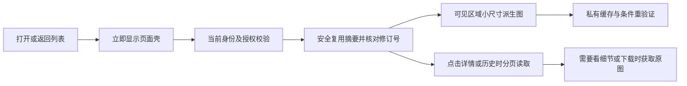

# 性能根因与长期整改方案 · 2026-09-27

## 生产发布 0.2.8 · 已完成

用户已明确授权打包、部署生产及Git提交。整改代码已提交8c93c36，生产版本为e765df7915173f4539fc8fbc57e66547f3db8d14。2026-09-27已发布至https://zhitu.qhhengxin.top，前端0.2.8、schema0019。发布前核验schema0017、完整既有Compose覆盖链、两类在途任务均0；排空后备份并迁移0018/0019。不启用容量准入和可选媒体拓扑。下文“未部署”为对应历史阶段记录，以本节为准。

发布增量独立审查最终Stage1 PASS / Stage2 PASS，candidate `bc30a4f0cc6fa55d3c823e8f04c9af97b0e1c37d3a4915da2a9942c4e3b97282`。因代理数量上限复用已结束的独立reviewer，重新读取范围和验证，未沿用业务旧PASS。初审打包隐私闭合白名单及故障分支覆盖不足已修；再审发现二进制UTF8误判已修。最终审查未发现新增HIGH/MEDIUM。

独立证据：发布测试7项通过（0.050秒），真实dist480文件审计通过，包含压缩文本解压审计和二进制字节扫描；构建29.63秒、前端194项通过。新增故障模拟真实执行部署控制器：备份失败不得迁移、迁移后失败恢复旧app保留新schema、回滚失败保持入口关闭。最终镜像安装及线上验证结果如下。

安装验证整改：6ab4b54包的镜像首次pytest在收集阶段失败，原因是六个开发运维工具测试引用未随精简镜像交付的infra源文件，另一个契约源码比较依赖前端源文件。安装测试精确排除六个开发工具文件及单个前端源码对照用例，其余契约/业务测试保留，本地全套证据保留。独立复核新candidate `1ce19c715c483c059781143d628aa82b187faa2a96104a3ea2c1bff930836bc8` Stage1/Stage2 PASS，无新增HIGH/MEDIUM；8项发布测试0.043秒通过。前端依赖审计critical=0、high=62、moderate=39、low=5（既有依赖告警，未宣称零漏洞）。

### 最终产物、部署与线上验收

- 发布标识`performance-20260927-e765df7`，782文件、4902969字节；压缩包SHA256 `32477c626fbedbd092b56164f7e898e6749d9aaeda9e209a3c9c16bc49b6aa9c`。上传后再次核对哈希，源文件来自已审Git提交，隐私和归档字节校验通过。
- 实际生产镜像在无网络隔离容器中测试：**1268 passed、75 skipped、1 deselected、15 warnings，169.30秒**。跳过为需要独立PG/MinIO等环境的用例，不冒充全套真实外部服务测试；本轮生产读请求和此前隔离外部服务证据另列。无收费生成。
- 数据库备份386126字节，`pg_restore --list`可读取；备份目录`/opt/hengxin-backups/performance-20260927-e765df7`，含旧原生app、前端入口/元数据/配置。旧镜像及完整Compose链保留在`/opt/hengxin-releases/performance-20260927-e765df7/old-paths.json`，秘密配置仅存服务器0700目录。自动回退恢复旧代码和配置，保留新增schema，不覆盖业务数据。此次部署未触发回退。
- API、两类outbox、API worker、image-variants及web运行，核验时重启计数均0；原生worker active。API worker pool5、原生worker队列核验通过，数据库/Redis/MinIO ready，channel恢复未暂停，capacity gate仍关闭。Worker初启动第一次探测未就绪，内置重试后通过，并非最终失败。
- 部署后逐文件SHA核验：原生app157文件、镜像后端296文件、前端481文件全部匹配发布清单。公开HTTPS首页200、ready200，HTTP首页字节SHA与本地构建一致；浏览器真实加载登录页及钉钉登录入口，无白屏。未使用真实用户钉钉交互完成登录，未验证收费生成。
- 生产登录态API只读探测使用临时服务端会话，finally撤销，不输出令牌，不修改任务/用户。两域各抽样原图下载SHA与记录一致；256/1024均返回WebP、private,no-cache，ETag条件请求304且正文0；匿名及撤销会话即使携带ETag也返回401。

| 线上同页请求 | 发布前 | 发布后 | 边界 |
|---|---:|---:|---|
| CLI列表pageSize20响应体 | 49915B | 49915B | 契约保留；发布后含授权17条SQL |
| API列表pageSize20、view=summary响应体 | 561490B | 5608B | 减少99.00%；发布后含授权7条SQL |
| CLI列表服务器内网单次 | 462.6ms | 63.8ms | 非浏览器首屏、非p95，受预热和负载影响 |
| API列表服务器内网单次 | 558.1ms | 133.7ms | 同上，不承诺固定提速倍数 |

历史图回填已完成：**553/553张，每张256及1024两种表示均已登记，最大尝试次数1**；现存ready原图与派生source_checksum一致。全量不是仅抽样完成：

| 图片域 | 张数 | 原件总字节 | 256总字节 | 1024总字节 |
|---|---:|---:|---:|---:|
| CLI/共享文件 | 305 | 140505328 | 2552656 | 13210998 |
| API图片 | 248 | 164359613 | 2172808 | 12025012 |
| 合计 | 553 | 304864941 | 4725464 | 25236010 |

256体积合计减少98.45%，1024减少91.72%；这是全部当前ready图片对象的总量比较，单次页面只加载其中一部分。原件未删除，预览/下载仍可能需要原图。新图上传或生成后仍由后台消费者异步补齐；此发布不消除公网延迟或模型生成耗时。

证据：`output/release/performance-20260927-e765df7/package-audit.json`及`installation-tests.log`；`output/performance-production-before.json`、`performance-production-after.json`、`performance-production-verification.json`、`performance-production-backfill.json`。Git发布提交已本地保存，未推送远端。

## 最新执行范围：直接性能改善合并交付

用户要求停止冗余扩展。本节覆盖下文历史A–H必须顺序完成的安排；已完成的媒体/连接/身份基础保留，额外硬配额、全局调度、独立ZIP及完整生命周期治理暂缓。当前代码本地实现，未提交、未部署、无收费生成。本轮最终独立审查记录见本节末尾。

### 本轮落地

- 图片：新增有限256/1024 WebP派生，四处原件就绪在同一事务登记；单独单进程消费者读持久队列、顺序转码、有限退避和过期租约重试。使用现有PostgreSQL/MinIO/Pillow，无新增Redis协议。Compose的image-variants服务池1/overflow0、1CPU/1GiB；总数据库预算68/100。后台开启有界旧图回填，原件不变；未就绪暂回原图，完成后下一次读取自然切换。冷图首次并非保证立即小图，上线前需运行回填并确认完成率。
- 交付：同源原路径的variant参数，鉴权/文件资格先于表示选择与304；private,no-cache及Vary Cookie/Authorization，每次复用仍请求当前授权。原件/下载保持原有路径及字节；图片错误no-store，禁用/删除/存储不可用不能返回304。派生使用媒体API直接交付，原件保留既有可选Nginx内部交付。
- 页面：缩略位使用256，结果/对比等大卡使用1024；点击预览、下载、返工仍用原件。屏外图片懒加载，原素材/模板历史/诊断折叠未展开不挂载内容。未修改视觉结构。
- 查询：API新前端显式view=summary，列表只查封面/计数/批次；详情仍完整。无view参数保留旧列表契约，支持旧浏览器页在后端先更新期间继续运行。CLI批量预取，精确计数、分页和Task契约不变；其feedback仍随历史增长，未宣称CLI载荷和详情历史全部有界。
- 刷新与启动：隐藏页面停止轮询，恢复经过已有身份门禁；可见API列表10秒，终态详情30秒同步，写后立即刷新。CLI终态详情30秒。启动身份仅同epoch一次性交接，避免重复鉴权，不长期缓存身份。高亮库改成实际存在代码块时动态加载。

### 同数据证据

| 场景 | 改前 | 改后 | 测量边界 |
|---|---:|---:|---|
| CLI列表12任务SQL | 127 | 16 | 隔离SQLite/ASGI，包含授权 |
| API列表9任务、每图8版本SQL | 228 | 6 | 同数据，摘要不访问版本/attempt |
| 同上API响应JSON | 210923B | 3797B | 约减少98.2%；详情仍完整 |
| CLI列表JSON | 22989B | 22989B | 仅减少查询，契约未缩减 |
| 固定1200×900测试图 | 3245068B | 256:14934B；1024:502240B | 确定性噪声PNG样本，不能代表全部真实图片压缩率 |
| 真实两层代理/MinIO测试大图 | 约7089440B | 约15630–16420B | 两类图片，256派生；完整原件哈希不变 |
| 生产构建入口JS | 1628763B | 约666KB | 入口单文件；另有按需高亮块约963KB，未减少所有功能总包体 |

浏览器在同一1440×900视口、同图fixture和真实应用下对照原图/小图：首屏近视口请求32/44张，图片正文103842176B→477888B。刷新32次授权条件请求304，正文0；返回页面也未重传图片正文。两组首次页面观察4699ms/2563ms，刷新1052ms/1020ms，返回934ms/1160ms；这是本机Vite与HTTP fixture的单次功能测量，受开发编译/预热影响，不作为生产提速比例或p95。CLI/API SQL/JSON是真实应用与隔离数据库，媒体另有真实PG/MinIO/Nginx测试。

证据路径：output/performance-direct-before-lists.txt、performance-direct-after-lists.txt、performance-direct-backend.txt、performance-direct-frontend.txt、performance-direct-typecheck.txt、performance-direct-build.txt；output/playwright/performance-direct/evidence.json及前后截图；output/playwright/performance-1a/evidence.json；output/performance-implementation-20260927/media-1b.json、db-budget-1b.json、capacity-1b.json。

本地回归：后端1281通过/171环境相关跳过/15警告；前端194通过；类型通过；生产构建通过（现有大块提示保留）。新增图片5项及列表2项独立重跑通过。真实PG连接54应用+1迁移+10维护+3保留；迁移0017→head重复执行、旧回执保留、旧图回填登记验证通过。原身份五项浏览器回归通过：44图失败合并核验、恢复门禁、旧响应跨身份拒绝、禁用、跨标签退出。没有声称生产效果已验收，也没有新增业务JSON长期缓存。

最终回归补充：backend完整套件96.92秒；前端194项；vue-tsc --noEmit输出PASS；最终vite build30.95秒，实际index.html入口index-DsbUtZAc.js为666074B。Playwright真实API/CLI页面标注专项也通过：790×1500原图下载、失败重读、指定历史V1、矩形/画笔/平移、原尺寸PNG导出、冻结body/key重试、409保留草稿及1280×720按钮可见；测试未访问生产或收费模型。

部署执行留待另次授权：先迁移0019并更新后端/消费者，确认回填与私有缩略请求，再发布新前端；旧前端继续默认detail兼容。若回退，先回前端后回后端，保留派生表/对象和原件；停止消费者即可暂停额外转码，不修改原件。不能用这份本地验收替代生产首屏/导航/刷新测量。未开启的容量准入和可选媒体拓扑继续按其既有开关管理，不顺带启用。

### 独立审查与修复

初次候选669a8c1ab962be19477552befee356b7fc08e6c478c21cd945caf38378ea6cac：Stage1 PASS / Stage2 FAIL，无HIGH。三项MEDIUM：首次详情失败后不再自动恢复；列表等待期间隐藏仍追加详情请求；新增测试使用any。已补selectedId/未加载/错误恢复条件及await后的可见性门禁，新增真实composable虚拟时钟故障与竞态用例，改为真实ReturnType。修复后前端194项通过；需最终快照复审登记后才算交付。

最终fresh code-reviewer复审：**Stage1 PASS / Stage2 PASS，无新增HIGH/MEDIUM**。批准快照为`ee71fd6d0c0345babf3657c6424e4598531fb89a46753ff5c2c76ddf93436282`；构建自动恢复components.d.ts到HEAD导致653e4b旧候选失效，reviewer复核生成声明和当前实现、两次prepare一致后明确批准新编号。

独立证据：图片/列表后端7 passed, 2 warnings in4.79s；前端摘要/身份交接/真实轮询专项4 passed。reviewer读取完整最终输出：后端1281/171skip/15warning96.92s，前端194/0fail，vue-tsc PASS，vite入口666.07kB/gzip229.61kB、30.95s构建成功；实看两张1440×900前后截图确认布局一致。

逐项定位：派生与恢复为variants.py:13/31/61及variant_worker.py:21/47；四写入同事务为files/service.py:35、api_image_edits/files.py:46、execution.py:108、execution/delivery_storage.py:64；摘要兼容为api_image_edits/router.py:92、presentation.py:70、summaries.py:10、tasks/list_batch.py:14；缓存授权为files/router.py:53、api_image_edits/router.py:58、variant_delivery.py:9；页面为PicturePreview.vue:2、TaskDetail.vue:24、RealTaskDetail.vue:40；轮询修复use-records.ts:52及records-polling.test.ts:57；一次性交接bootstrap-user.ts:4、main.ts:106、beforeEach.ts:248，高亮highlight.ts:45。专项扫描未发现新增硬编码密钥/危险动态执行入口；测试new Function只执行仓库内composable源码。所有结论限本轮和已说明验证环境，不批准生产性能或整机容量。

状态：诊断与长期方案对抗审查已完成；用户授权后，0A/1A基础子批已在工作区实现，通过本地测试、类型检查、生产构建、隔离浏览器回归及独立两阶段代码审查。尚未部署，端到端性能预算与容量验收尚未完成。用户反馈关闭 VPN 后图片加载、页面切换仍慢，本报告不以 VPN 解释或替代产品性能问题。最新实施证据见文末。

本文件为本次性能问题的唯一维护报告，已合并9月23日排查、上线整改建议与9月27日独立代码复核的有效内容。最新结论以9月27日实测为准；历史数据仅作为带日期的背景。

## 范围与执行规划

诊断阶段只读检查代码、生产配置和真实数据，产出整改建议；该阶段不修改业务代码、生产配置、任务数据或 VPN，不重启服务，不触发生图。随后授权的工作区实施范围独立记录在文末。

1. 复核页面加载、导航、图片渲染和缓存链路。完成标准：结论附源码位置，明确哪些请求重复、哪些字节不必要。
2. 只读测量生产列表查询、封面体积和存储读取。完成标准：使用只读事务、分别记录 SQL 次数/耗时/JSON 字节/图片字节，不把内部函数时间当成用户端耗时。
3. 独立复核软件侧判断。完成标准：排除旧报告中已过时的假设、区分已证实成本与待验证风险。
4. 提出分阶段根治方案和验收预算。完成标准：分别覆盖图片、列表、轮询、页面启动及观测；保留原图、权限、历史版本与现有业务语义。
5. 对抗式审查长期成立条件。完成标准：用数据增长、并发叠加、崩溃、乱序响应、权限撤销和混合版本发布挑战方案；把发现的缺口、设计约束和可证伪的验收条件合并到本报告，不另建报告。

## 结论

软件侧存在能独立成立、可量化的性能浪费，而且集中在每个页面都要经过的公共链路：**小图下载原图 → 无 HTTP 缓存 → 页面返回重新挂载 → 列表获取全部详情和历史 → 定期再查询整份数据**。不是一个按钮或一个页面的问题。

优先级最高的是建立图片分级交付和私有缓存，其次是列表摘要查询和轻量状态刷新；同时消除页面重复启动成本。现有证据不支持把加 CPU、扩大连接池或增加生成并发作为第一步。

原方案方向成立，但只规定“小图、少SQL、少轮询”还不够：一次SQL也能扫全表，后台转码也能丢任务，缓存也能返回过期权限，多进程也能耗尽同一块磁盘。长期设计必须同时约束每次交互的工作量、后台任务的交付和恢复、共享资源的准入，以及数据和权限的一致性。

这里的“根治”是消除不必要的成本，并在明确的数据规模和负载范围内持续达标、超出容量前能发现并扩容。无限历史、任意并发和任何网络下瞬间显示不是可实现承诺。下文是待实施方案；涉及新增派生文件、历史分页、下载准备流程和性能目标的内容，实施前要同步源需求与计划，不能把本报告当作产品代码已完成或原Spec已承诺这些能力。

## 第一性原理：用户到底在等什么

页面可用时间由关键路径决定：代码加载/执行 → 身份与路由准备 → 页面数据 → 可见图片 → 解码和绘制。并行请求不能简单相加，但串行依赖的延迟会相加；图片吞吐和并发槽位又会影响后续请求。

需要优化的四个量：

1. **必要字节**：44像素封面不应交付几十万字节的交付原图；列表不需要所有历史提示词。
2. **必要请求**：未进入视口的图片不应争抢首屏资源；无变化页面不应反复取完整历史。
3. **每次请求的工作量**：12条列表不能随着每张图、每个版本逐个查数据库。
4. **重复访问的复用程度**：回到看过的列表应复用安全范围内的数据/图片，刷新必要变化。

优化后的目标链路：

## 本轮生产证据

环境：API容器 `hengxin-vps-staging-api-1`，镜像 `hengxin-smart-image-backend:delivery-20260927-b1f212b`，FastAPI 0.139.2，前端0.2.7。本次五个关键后端文件与本地按LF归一后的SHA256一致；两个文件仅原始换行形式不同。

诊断直接调用现有列表服务函数，数据库事务强制 `READ ONLY`、单条语句超时5秒，采样后rollback。未写任务、未新建会话、未调用模型。下表SQL和耗时不包含HTTP鉴权、公网传输或浏览器渲染，也不代表压测p95。

| 当前实际页面数据 | 数据查询成本 | 小图所指原文件的体积 |
| --- | --- | --- |
| 任务中心第一页12条，总33条未删除任务 | 195次SQL；最终3次采样181–273ms；诊断JSON 32,197字节 | 12个不同文件，共6,296,561字节，约6.30MB |
| API换图记录9条 | 398次SQL；最终3次采样336–453ms；紧凑JSON 409,140字节 | 9个不同封面文件，共3,204,770字节，约3.20MB |
| 模板库第一页12套，总18套 | 31次SQL；单次94ms；紧凑JSON 10,929字节 | 每卡最多4图，实际44个不同文件，共18,235,772字节，约18.24MB |
| 成品库当前1套 | 11次SQL；单次20ms；紧凑JSON 1,061字节 | 4个不同文件，共2,151,224字节，约2.15MB |

图片字节按前端实际渲染位置引用的文件ID去重计算，是这些图完整加载的字节预算；不是浏览器瀑布测得的“首屏已完成传输字节”。模板库四图布局当前共44张，两版探针修正了字段命名和布局上限，最终结果见 `*-final.json`。

API列表包含71个图片项、72个历史版本；其中版本数组JSON合计324,614字节，约占整份紧凑JSON的79.3%。任务级提示词另有38,475字节。只看任务名称、进度和一个封面，也在付出完整版本历史的查询与传输成本。

同一时段，单张529,103字节图片从MinIO直接GET并读完约13.7ms；该探针绕过 `MinioStore.open()` 的桶管理检查，因此不是完整图片HTTP接口耗时。主机约5.7GiB内存可用，vmstat两个间隔样本CPU空闲98–99%、I/O等待0、无换页；数据库快照active 1（含诊断自己）、idle 9。仅说明本次采样未见资源饱和，不排除历史高峰。

证据文件（Git忽略、本地保留）：

- `output/performance-20260927/server_probe.py`、`server-probe-final.json`
- `output/performance-20260927/supplemental_probe.py`、`supplemental-probe-final.json`

历史基线（2026-09-23）：当时12条任务列表为182次SQL、322.8ms，10张封面共5,964,213字节；单张450,052字节图片内部读取27.7ms。两次数据集不同，不能把数值变化直接当成性能退化或改善。旧采样同样未捕获连接池耗尽，也没有浏览器瀑布或并发峰值验收。

## 已确认的软件成本

### 1. 通用图片组件没有“缩略图”这一交付层，影响几乎所有图片页

`frontend/src/views/hengxin/components/PicturePreview.vue:2` 用 `picture.url` 同时作为小图src和放大预览地址，没有缩略图字段、srcset或懒加载。`PictureMosaic.vue:3` 每套立即渲染前4张；`Templates.vue:55` 每页12套。API记录的52像素封面也复用该组件；CLI任务封面是44像素。

后端 `modules/tasks/queries.py:30`、`modules/files/router.py:23`、`modules/api_image_edits/files.py:13` 返回原文件content地址，文件模型只有原文件元数据。前端把图片视觉缩小，不会把下载文件缩小。

**整改**：在保存上传图/收集生成结果后，用受限后台任务生成派生图，建立“列表小图、卡片/普通预览图、交付原图”分级。保留原图字节与哈希，原图预览/编辑/下载能力保留。已有图片分批幂等补齐；请求热路径不做同步转码。卡片按显示尺寸选档，首屏优先、离屏懒加载；不把所有历史图预先挂载。

派生图未就绪时显示可解释的状态，不能全量自动回退原图形成第二次流量高峰。派生图采用独立且不可变的资源身份；同事务登记作业、有限重试、发布去重和生命周期协议见“长期设计”A、F，不能仅写一个后台回调就算完成。

独立复核还发现**折叠不等于不加载**：`TaskDetail.vue:24–29` 的输入折叠区仍挂载 `TaskTemplate`/`TaskSources`；API `RealTaskDetail.vue:40、65` 的默认折叠区仍创建整套输入图；`TemplateHistory.vue:7–16、38–39` 一次取全部模板版本并创建图片表格。本地锁定的Element Plus 2.11.4 Collapse用v-show隐藏内容，未阻止子图片挂载；Image无lazy时挂载即设置src。用户没展开的内容，也会争抢图片资源。

这几处应按首次展开创建组件/请求，折叠时保留必要摘要；不能仅改CSS隐藏。CLI执行轮次材料 `RoundHistory` 已按展开挂载，大图viewer也只渲染当前图，不能一概说所有历史内容都预加载。依据：[Element Plus Image懒加载](https://element-plus.org/en-US/component/image.html#lazy-load)；锁定版本源码 `frontend/node_modules/element-plus/es/components/collapse/src/collapse-item2.mjs:74–87` 为无条件renderSlot加vShow，`image/src/image2.mjs:146–170` 在无lazy时挂载即设置src。

### 2. 图片禁止缓存，页面销毁后再回来又要承担下载成本

CLI `modules/files/router.py:58` 与API `modules/api_image_edits/router.py:62` 均设置 `Cache-Control: private, no-store`。`no-store` 禁止HTTP缓存存储响应；它不是“只允许自己缓存”的意思。参见 [MDN Cache-Control](https://developer.mozilla.org/en-US/docs/Web/HTTP/Reference/Headers/Cache-Control)。

`frontend/src/router/modules/index.ts:16–39` 的现有业务页面均 `keepAlive:false`，离开后组件销毁，返回重新读取数据/挂载图片。图片仍在原页面保持挂载且URL不变时，列表轮询不必然重下图片；不能把“每3秒拉数据”说成“每3秒重下所有图”。

**整改**：采用 `private, no-cache` 配合实际交付表示的ETag。每次先验证身份、权限及文件访问资格，再判断是否返回304，减少重复传输。父资源逻辑删除不必然使仍受归档/历史引用保护的文件失效。ETag只省响应体，不能省掉授权和网络往返；长期max-age或裸露签名URL不能替代下一请求重新授权。

列表缓存按身份、会话代次、资源范围、筛选、分页和接口版本区分。返回先显示页面壳，当前授权确认后再复用数据；退出、身份失效、乱序响应、跨标签页及bfcache恢复统一处理，见长期设计D。不要全站开启KeepAlive，避免新任务表单、草稿和URL语义被错误保留。

### 3. 列表与详情共用序列化，数据库和JSON成本随图片/历史增长

CLI `modules/tasks/queries.py:167` 每行调用 `serialize()`；该函数逐任务/槽位/素材读取轮次、版本、文件、归档、Skill等。API `modules/api_image_edits/presentation.py:80` 每行直接调用 `task_view()`，后者 `:29`、`:59` 逐图片读取并返回所有版本。这与本轮195/398次SQL和409KB数据一致。

**整改**：建立明确的列表摘要契约，只返回名称、状态、计数、封面派生图、创建人/时间、必要操作权限。按当页任务ID批量读取/聚合数据；普通详情只取当前状态和有限结果，版本/轮次/执行材料分别分页。原有整组预览通过有限窗口、指定版本定位保留。不能把全历史成本简单推迟到点开详情；SQL次数、扫描量、响应字节和历史规模一起验收，见长期设计B。

要检查模板/成品的同类逐行关联读取，但当前它们更大的已知成本是原图字节；不要先给每张表盲目加索引。索引根据真实筛选/排序和EXPLAIN制定，无法单靠索引消除数百次逐条查询。

### 4. 重型数据被持续轮询，隐藏页面也继续消耗资源

API `frontend/src/views/hengxin/api-image-edits/use-records.ts:43–44` 每轮等待列表和已选详情完成，再间隔3秒重拉；不区分全部终态，没有 `document.visibilityState` 暂停。`use-channel.ts` 另有状态轮询。CLI `components/use-task-list.ts` 按任务状态3/10秒轮询，隐藏浏览器标签未暂停；模板/CLI列表搜索缺少防抖。

接口层 `frontend/src/api/hengxin/http.ts:14` 只有超时signal，未接收页面生命周期/筛选变化的取消signal。请求序号过期只是丢弃结果，已经发出的网络/服务端工作仍然发生。正常轮询有await，不存在“每3秒无条件无限叠加”的证据。当前路由离开会卸载并停止后续定时器，不能误报为KeepAlive残留轮询。

**整改**：停止完整历史/详情的周期查询，改查列表集合修订和所有当前可见、已打开任务的修订；终态只降低轻量探测频率，不能完全失去页外任务的返工/恢复/删除通知。标签隐藏暂停、恢复时立即校验；搜索防抖；请求去重和可取消；失败退避；未变化对象保持稳定。修订的提交顺序、删除语义和发现时限见长期设计C。浏览器取消不保证数据库立即终止，必须同时缩短后端查询。

API `use-records.ts:31、39` 每轮替换完整tasks/selected，`RealRecords.vue:12、40–44`、`RealTaskDetail.vue:63–66、74` 随之重新遍历图片项计算统计。JSON解析、校验和响应式更新属于确定的额外工作，但尚不能换算成用户卡顿秒数。API搜索已有300ms防抖（`use-records.ts:47`），不要重复实现；取消/去重优先作用于读取，不破坏收费生成及幂等写操作。

### 5. 页面启动和首包还有额外成本

`frontend/src/main.ts:73` 先 `fetchGetUserInfo()`，然后初始化路由；`router/guards/beforeEach.ts:278、358` 又调用同一个身份读取。`api/hengxin/client.ts` 只缓存service对象，`http.ts:54` 的getUser每次仍请求后端。这是刷新启动路径上的重复串行工作，不能推广成“每次路由切换都重新鉴权两次”。

另外，`main.ts:19、35` 全局注册指令，经 `directives/business/highlight.ts:45` 静态导入完整 `highlight.js`。本次业务页面未使用该指令，产物却含全语言注册。现有主JS原始1,624,437字节；线上gzip响应594,874字节。钉钉SDK已动态导入，不列为已证实的首包问题。

**整改**：复用同一次启动身份请求，后端每个受保护请求仍鉴权；将高亮库延迟到实际使用页面并只加载所需语言，随后用构建分析量化收益。首包按业务必需依赖收敛，不能用手工切chunk保证性能。带内容哈希静态资源设置明确长缓存、HTML重新验证。

线上两层Nginx已核验gzip在外层生效，不能重复写成“尚未启用gzip”。主包压缩后仍有实际传输/执行成本，但尚无用户浏览器长任务记录，不能断言主线程卡顿占几秒。

### 6. 图片传输仍与数据库/业务API绑定，是应修复的资源耦合

两套图片接口完成鉴权和文件查询后，仍通过API读取MinIO并 `OwnedStreamResponse` 输出。数据库依赖 `app/db/session.py:21` 使用yield，默认请求作用域；当前FastAPI的清理时机在响应结束后。参见 [FastAPI依赖作用域](https://fastapi.tiangolo.com/tutorial/dependencies/dependencies-with-yield/)。

`storage/minio_store.py:44–46` 每次open还执行 `ensure_private()`，包含桶存在检查和桶策略查询，随后才GET文件。普通图片读热路径混入了存储管理检查。

**整改**：鉴权、文件有效性和必要元数据取得后释放完整依赖链中的数据库资源，再开始字节传输；保留客户端取消/异常时关闭存储连接。把桶安全状态检查移到启动/运维和有界复验机制，维持私有桶保护。目标交付路径采用API短请求鉴权、Nginx受控内部传输；任何代理缓存命中、HEAD、Range和304都必须位于授权之后，具体信任边界见长期设计D。分离交互与批量传输的资源预算见E。

本轮没捕获连接池耗尽；代理缓冲可能缩短慢客户端对API的影响。这里是有证据的资源耦合和容量风险，不能当成已经发生的连接池故障。无需先重构整套存储或换框架。

## 对抗式审查：原方案为什么还不能叫长期方案

两路独立审查均判定原方案 **Stage 1：FAIL，Stage 2未执行**。一组挑战容量、增长与故障恢复，一组挑战权限、缓存和一致性。以下是方案缺口，不是声称生产已经发生这些故障。

| 合并后的问题 | 可以击穿原方案的反例 | 本次修订落点 |
| --- | --- | --- |
| 后台转码缺少交付保证 | 原图提交后、入队前崩溃，永远只有占位；回填淹没新图 | A：事务内登记、持久状态、租约、分配容量、恢复时限 |
| 少SQL仍可能慢 | 8条SQL扫描百万任务；深OFFSET和低选择性搜索仍耗时 | B：扫描预算、汇总、索引、分页与搜索分开验收 |
| 点开详情再次爆炸 | 一个返工千次的任务一次返回全部版本/轮次 | B：普通详情有界、历史分页、指定旧版本定位 |
| 少轮询漏掉变化 | 打开的终态任务已不在当前页，别人返工/恢复/删除无人发现 | C：集合修订＋独立的已打开任务修订探测 |
| 缓存破坏身份边界 | A退出后旧响应填进B的页面；被禁用后仍显示旧数据；缓存先于鉴权命中 | D：会话代次、恢复授权门禁、授权先于304和内部交付 |
| 拆进程未隔离资源 | 转码、50图收取、ZIP并发挤占同一DB、内存和磁盘 | E：全局准入、资源预留、批量下载独立处理 |
| 派生物变成容量债务 | 每次算法升级多存一批图；无引用孤儿和临时包不断增长 | F：有限档位、生命周期、删除回执、空间水位 |
| 一次压测无法防复发 | 队列每天略微积压，60分钟通过，一周后失控 | G：可重放负载、连续SLO、阈值对应动作 |
| 回滚镜像不等于回滚系统 | 混合版本漏作业；回填覆盖新状态；旧前端依赖已删除字段 | H：增量兼容、持续对账、独立开关、保留新数据 |

## 长期设计：保留现有技术栈，改变成本和交付契约

继续使用Vue、FastAPI、PostgreSQL、MinIO与已有任务队列；共用领域逻辑，不先拆一批微服务。必须拆开的是交互请求、媒体传输、后台计算的工作量和资源预算。下面的约束是实施和验收合同的草案，不是当前已具备能力。

### A. 图片成为可可靠交付的多档资源

**契约。** 保留现有原始文件ID、字节和SHA256；新增明确的`original`与`variants`表示，禁止把原有`picture.url`全局替换成小图。标注、导出、下载、模型输入、返工和冻结快照继续指向原件。初始预设建议长边160/480/1280像素，按实际组件尺寸与DPR验证选档，保持比例、不强制裁字、不放大低分辨率源图。档位、编码参数、方向/色彩处理和算法版本固定，不能让任意URL参数制造无限转码。

CLI与API原文件表仍保持各自身份；派生记录标明来源域，并用互斥外键等可校验约束关联真实原件，不能只用一个无约束字符串假装跨表外键。唯一身份至少包括来源域、原文件ID及校验值、预设、处理规则/编码器版本；不同表示用不同URL和ETag。原图损坏或缺失必须明确不可用，不能用已有缩略图冒充可编辑/可执行原件，也不需要为每次304重新读完整原图验哈希。

**交付协议。** 当前上传与生成收图有多条`staging→ready`写入路径（`modules/files/service.py:33–40`、`api_image_edits/files.py:44–46`、`api_image_edits/execution.py:84–95`、`execution/delivery_storage.py`），必须逐一覆盖：

1. 原件就绪的同一数据库事务登记派生意图和待派发记录；原件成功不等待转码，派生失败不改变生成任务成功状态，更不能重调模型。
2. PostgreSQL持久作业是事实来源，Redis/Celery只是唤醒；复用现有outbox的可靠模式，另设派生作业类型和队列，不直接套用生成任务的恢复语义。提交后进程崩溃、Redis短暂不可用仍可从数据库补派。
3. 状态为`pending/processing/ready/retry_wait/failed`，保存尝试次数、下次重试时间、租约、认领代次和错误原因。过期任务可重新认领；晚到Worker必须按代次比较后才能发布。重试有上限，失败进入可见的修复列表。
4. Worker在受限解码环境生成临时结果，验证格式、尺寸、字节数和摘要后再发布；对象键不可变。数据库唯一约束、认领代次和原子发布防止重复有效结果。PUT成功但提交结果未知时先对账，失败Worker不得删除可能被成功Worker采用的对象。
5. 定期按有界批次核对“ready原件缺少意图/派生”的差集，补齐旧Worker、历史资料和异常窗口。回填有检查点、尾部追赶与版本校验，不依赖一次遍历。

新图与历史回填使用独立执行份额，至少保留新图专用处理能力；一个不可抢占的大回填任务不能占据全部Worker。先处理首屏档位，再处理较大预览档位。限制每进程及全机合计的解码像素、帧数、内存、CPU时间和同时解码数；已有上传大小/格式/Pillow限制继续保留，`validation.py`的进程内Semaphore不能被误当成全机限制。

建议新图首个小档从原件ready起p95≤5秒、p99≤15秒；依赖恢复后漏派发在60秒内重新成为可调度任务，整个积压清空时间按实际服务能力另测。超过预期显示“处理中/失败可重试”，允许用户主动打开原图；禁止44张图同时自动回退原图。单图连续失败的重试次数初始建议3次，超限报警并留待修复。以上均待容量测试定标。

### B. 列表和普通详情的成本不随历史版本线性增长

定义三种接口，禁止继续复用完整`serialize/task_view`：

| 类型 | 返回与工作边界 | 历史增加时必须保持不变的量 |
| --- | --- | --- |
| 列表摘要 | 当页名称/权限/进度计数/封面/修订；页大小设上限，原有分页URL与筛选保留 | 不逐版本查询；不返回历史提示词/attempts；当页字节及关联查询数有界 |
| 普通详情/状态 | 当前轮次、当前结果的有限窗口、必要操作状态；大结果集合也分页 | 不扫描所有历史来算当前状态；状态刷新不返回整份详情 |
| 版本/轮次/执行材料 | 稳定游标分页，建议每次20条；支持按不可变版本/轮次ID直接定位 | 打开旧版无需先拉全部前置历史；前端只挂载当前窗口 |

整组预览保留组内定位与上一张/下一张能力，按窗口补取；下载整组由服务端清单处理，前端不为下载先装载全部历史。API继续现有当前版本冲突检查；CLI允许明确指定历史版本返工，不能一刀切成“只许最新版本”。

第一步直接从权威业务表按当页ID批量读取，取消N+1。对当前封面、状态计数、归档状态等仍需遍历历史的字段，采用同事务维护的汇总列/窄摘要表；不先引入异步读副本。业务写入时同步更新业务记录、相关摘要和任务修订，原件/版本表仍是可重建的事实来源。创建、收图发布、状态变化、返工、恢复旧版、删除、归档增删均列入业务更新矩阵；派生就绪单独更新文件表示修订，不同步遍历所有引用它的任务或归档。摘要只保存原文件引用，按当页有限文件集批量关联当前表示；不能把读优化变成一次转码触发上万条父记录写锁。补齐摘要按任务短事务、检查业务修订再写，不能覆盖并发新状态；定期抽样核对及有界重建发现漂移。列表、计数和各自修订须在同一一致读取快照中生成，响应完成立即释放事务。

SQL≤15只是往返预算。另设查询成本合同：

- 按当前真实数据、1万/10万任务、最多200万历史版本、单任务1000轮历史建立有偏斜的测试集；这些是拟验收范围，不是生产现有规模，也不代表所有版本都要上传大图。
- 列表封面/计数关联查询读取量只与当页条数、当前有限结果数相关。全员/我的状态统计用事务汇总与校验重建；保留`queries.py:129–141`现有统计范围，不能偷偷改成当前搜索结果计数。
- 筛选匹配的精确总数、任意页跳转、模糊搜索单独测p95/p99与`EXPLAIN (ANALYZE, BUFFERS)`，记录扫描行/缓冲访问/临时落盘/锁等待；不能把多个全表扫描藏进一条SQL。精确任意筛选计数本来就可能随匹配数增长，不能声称它是O(1)。
- 所有分页采用稳定复合排序，例如`created_at,id`。顺序前后页使用游标；保留现有页码跳转与URL恢复时，使用匹配筛选/排序/集合修订的页锚点，未命中锚点的任意跳页在窄摘要上计算，深页成本单独验收，锚点不能跨集合变化盲目复用。刷新/变更后按既有语义重新定位，不能出现跳错页却不提示。
- 依真实查询配置组合索引；名称/SKU子串搜索可评估`pg_trgm`，但单汉字、极短字符串、UUID转字符串和无匹配查询必须单测，不能假定三元组索引覆盖所有输入。保留精确计数和原搜索语义；如果在目标规模下仍不达标，这一批不能验收，需要进一步优化查询/分页索引或正式调整产品契约，不能用估算总数或砍搜索悄悄过关。

增长策略是“有明确支持规模并在接近前扩容/调整索引结构”，不是承诺任意页精确总数在无限数据上恒定耗时。PostgreSQL明确说明OFFSET跳过的行仍需计算，而全表`count(*)`需要遍历表或覆盖索引：[LIMIT/OFFSET](https://www.postgresql.org/docs/16/queries-limit.html)、[聚合函数](https://www.postgresql.org/docs/16/functions-aggregate.html)、[pg_trgm](https://www.postgresql.org/docs/16/pgtrgm.html)。

### C. 更新发现有界，而且不漏掉页外任务

增加独立、单调递增的业务修订号；不能复用可恢复为V1的`currentVersion`，也不能依赖未覆盖关联变化的`updated_at`。任务修订覆盖发布、状态迁移、返工、版本恢复、逻辑删除和归档；文件表示修订覆盖派生就绪、编码版本和资格变化。前端分别比较两类修订，缓存校验标识覆盖两者，任务状态没变不意味着小图没变。影响身份/角色的变化进入授权状态，不能只更新业务修订。

每个可见标签页共用一个刷新调度器：查询列表资源集合修订，再查询当前可见和已打开任务ID的修订/墓碑，以及当前有限文件集的表示修订。任务/文件ID分别按批次上限查询，建议每批40个，超出分批；详情即便不在当前列表页仍纳入。只有发生变化才补读对应摘要、当前详情或文件表示，不因某个共享文件就绪刷新全部父任务。终态不再拉全量详情，但保留低频发现；任务不存在/已删除必须显式返回，不能只返回存活对象。

首期建议活跃对象每3秒、终态每15秒轻量核对，发现目标分别≤5秒/≤20秒；任务虽已成功、可见派生图仍处理中时，文件表示按活跃频率核对。后台标签停止周期请求，恢复、重连、路由返回立即重新授权并核对。失败退避带抖动，离线不展示虚假的“已同步”；请求完成后再排下一次。重复读合并，筛选变化和卸载取消在途读取；任何旧修订响应不能覆盖新结果。

集合修订必须覆盖创建、删除以及当前页外的变化。首期可用每业务资源域一条事务修订记录：相关写事务加锁递增、与业务变更同时提交，读取摘要与修订使用同一快照；固定加锁顺序、短事务内无对象IO，压测这条记录的锁竞争。不能把事务开始时分配的自增序列最大值当提交游标，低序号晚提交会漏事件。修订记录热点达限后再分域/分片，不能默默丢掉发现能力。

SSE并非本轮必要条件。将来若替换轮询，事件必须可重放、有保留期/断线游标/游标过期全量重同步，消息只作提示，数据库修订核对兜底。轮询改推送本身不会消除错误的全历史查询。

### D. 缓存和字节交付遵守同一授权协议

Spec要求禁用/降权后下一次请求重新授权（`Product-Spec.md:600`），因此不通过延长鉴权缓存TTL换取表面速度。现有四角色共享业务资源；缓存里有`owner_id`不意味着改成只有创建人可读。

**应用状态。** 统一身份代次：退出、换号、会话失效立即递增，取消读取，清理摘要/详情/图片对象URL和受保护DOM；每个异步成功或错误处理都核对发起代次。旧A请求返回401也不能把新B会话退出。区分身份级拒绝（禁用/失效）与普通操作403，前者锁定业务界面，后者撤去对应操作或失效资源，不能把所有403当退出。跨标签退出广播只负责加速，服务端鉴权仍是保障。

原生ElImage/img请求不经过fetch的401/403处理，图片加载错误也不能分辨身份拒绝、404、坏图和断网。统一图片组件须按挂载时身份代次上报错误，在同一代次内合并、限频核验当前身份；确认身份失效才统一锁定，其余保留该图的错误/重试状态。44张同时失败只能触发一轮合并核验，不能再打出44个`/auth/me`；旧代次图片错误及其核验结果都不能影响新会话。浏览器原生响应中无法获得的状态，不靠猜测当成403。

页面返回、重新激活和`pageshow`从bfcache恢复时先锁定受保护内容、确认当前身份/权限后再展示缓存；`pagehide`等生命周期处理避免恢复时直接展示未经确认的旧DOM。离线可显示页面壳与网络状态，不用旧权限数据冒充可操作页面。普通活跃页已授权显示的内容，不承诺管理员一按禁用就能远程擦除；保证下一受保护请求拒绝并统一失效。`no-cache`不等于浏览器历史恢复必定重验，需要应用生命周期配合，参见[MDN Cache-Control](https://developer.mozilla.org/en-US/docs/Web/HTTP/Reference/Headers/Cache-Control)。首期不引入Service Worker/Cache API持久存储私有数据。

上述身份代次、失效清理、图片错误合并核验和恢复授权门禁，是任何私有HTTP缓存或应用数据缓存上线的前置条件；必须先通过跨账号、禁用、乱序响应和恢复测试。不能按“先加图片缓存、下批再补身份处理”发布。第3批只增加在该协议之上的业务摘要复用。

**文件交付。** 目标路径是：浏览器公共文件地址 → API当前鉴权/文件资格短查询 → 释放完整依赖链的DB资源 → 服务端生成内部交付描述 → Nginx从私有MinIO取字节。保持私有桶、受限网络和固定上游；桶管理检查在启动/周期复验失败时报警并停止不安全交付，不随每次读文件重复执行。

内部路径必须显式`internal`，只接受服务端查到的文件记录与规范化对象键；用户不能提供桶名、上游URL或自由路径。外部请求不能直接命中缓存后绕过鉴权，不返回可复用的存储直链；代理只缓存不可变的字节表示，不缓存授权结论。可使用X-Accel-Redirect配合内部存储代理；具体模块、签名方式和私有MinIO接入在隔离环境验证，不能假定部署已支持。[Nginx internal](https://nginx.org/en/docs/http/ngx_http_core_module.html#internal)、[代理与X-Accel-Redirect](https://nginx.org/en/docs/http/ngx_http_proxy_module.html)。

200、304、HEAD、Range、代理缓存命中均先走当前授权和资源检查；通过后再按实际表示校验ETag/范围/Content-Type/文件名。慢客户端不能长期占用DB连接；断开后及时关闭上游。允许已经授权开始的在途响应完成，后续新请求重验，不承诺撤回已发送字节。

浏览器缓存使用`private, no-cache`。热缓存仍有请求和鉴权成本，必须分别测响应体字节、首屏图片请求数、鉴权SQL、首图与页面可操作时间。首屏按实际可见图片请求，折叠内容不挂载，离屏不抢带宽；不能仅凭“返回304”宣称页面返回已快。

### E. 全局准入保护交互与已经产生的结果

资源边界按工作性质划分：交互/鉴权API池，媒体上传与传输，原件收取保存，派生Worker，ZIP Worker，历史回填。可复用同一镜像与数据库，初期仍可同机部署，但每类有独立执行额度；CPU/内存容器限额不能代替磁盘、DB和存储连接的总预算。

当前API配置5个Worker、每任务10图，可出现50路生成/收图；CLI另有任务并发。`modules/files/downloads.py:47–54`在ZIP开始时可能预开最多20条对象流，20份并发ZIP在该路径上最多可占400流。API ZIP不同：`api_image_edits/zip_download.py:26–36`先生成临时包，超过内存阈值会落盘；它已经在对象IO前提交DB事务，不能误报为此处仍持有事务锁。

实施前必须提交一张可核算的资源表，包含每进程数量×每池连接上限、峰值解码内存、对象流数、正在收取/上传的字节、ZIP临时空间和持久磁盘增长；预算总和不能超过实测容量。保留给交互、心跳/取消及已付费结果持久化的额度不能被回填、ZIP或新生成借光。

| 资源 | 准入/保护规则 | 过载动作 |
| --- | --- | --- |
| DB连接与查询时间 | 按所有API/Worker合计核算pool＋overflow，另留运维/恢复连接；短事务，交互独立上限 | 先停回填及非必要统计，再限制新负载；不盲目扩大pool |
| 内存/CPU/解码像素 | 原件收取、解码、ZIP分别有全机预算和进程配额；许可带租约/代次、异常释放与对账 | 暂停低优先级批处理；没有保存余量就不启动新的上游生成 |
| 存储连接/带宽 | 按类别预留，不一次为每份ZIP打开20条流；慢下载在交付层限时/限速 | 排队下载和回填，保护结果接收与交互 |
| 临时盘/持久盘 | 受理前按上限预留，运行中按真实字节更新；结果保存预留不能被临时包占用 | 停回填、清可回收临时物；不足时停止接纳新生成/批量工作，明确返回队列/容量状态 |
| 队列 | 新图、回填、ZIP分开，有限待处理量、最长等待报警，优先级有保留份额 | 不丢已受理任务；暂停生产低优先级新工作，不靠无穷排队隐藏过载 |

全局额度必须由跨进程协调的持久记录/租约或唯一调度器统一授予；本地Semaphore只是第二道限制。许可机制失败时停止接纳新低优先级工作；已经开始且结果可能收费的任务继续使用预留容量。接纳生成前按输出上限预留收图能力，不能等50张都返回才去争最后一点空间。试运行暂保持既有最大并发，把排队和拒绝设计好后再测是否能提高。

**ZIP长期路径。** 点击时冻结经授权的原文件/版本清单，独立Worker逐文件流式读取并验证，生成不可变打包结果后交付；准备状态可见、可取消/重试，清单与请求幂等绑定。无需让浏览器先拉全部历史。相同清单复用只发生在重新授权后；下载准备和实际GET都检查权限及所有清单文件资格，父资源删除仍按引用语义处理。临时空间预留、任务等待、包大小和并发有上限，取消/失败可恢复清理；慢下载不占DB或全部原图流。异步准备是新增流程，需先同步Spec，保留一键下载意图、名称、原图质量和版本选择；有限的小包旧路径只能作为有同样准入约束的兼容通道。

扩容顺序按测量触发：先把回填/转码/ZIP移到单独计算资源，再检查对象存储吞吐、DB查询和网络容量；必要时分离存储与数据库。不是看到慢就增加应用进程。即使分机，DB与对象存储的全局预算仍然有效。Celery的队列容量、幂等和长短任务隔离原则见[优化文档](https://docs.celeryq.dev/en/stable/userguide/optimizing.html)、[任务文档](https://docs.celeryq.dev/en/stable/userguide/tasks.html)。

### F. 生命周期保证图片越多也不会悄悄填满磁盘

分开定义业务资源逻辑删除、文件访问资格变化、对象物理回收；不能用一个删除标记代替三者。模板历史、全部成品版本、归档、返工冻结输入、标注与执行材料都是受保护引用，JSON中的文件引用也要可靠枚举或迁为可约束关系。某个父任务删除不等于文件无引用，更不等于归档失效。

当前`hengxin-smart-image/docs/CLEANUP-POLICY.md`与`worker/cleanup.py:65–90`明确清理默认禁用、只处理符合条件的旧staging/failed，ready原件没有自动回收政策；原件和会话保留期限仍待业务确认。本轮不擅自引入“保留30天”等规则，也不为了性能删除历史。

派生物可重建，但也需要记录归属、体积、编码版本、有效/待回收状态。旧预设先停止新引用，宽限期后分批回收；窗口长度由最长有效任务租约、缓存引用及发布回退周期决定。最终回收前在事务内核对源生命周期/引用、锁定回收代次，提交持久删除回执再删对象；失败可重试。晚到转码Worker的认领代次已失效，不能重新发布被回收派生物。临时孤儿与失败对象按拥有者、租约、校验和对账后回收，不能按文件名前缀粗删。

已有清理借助全表级锁保护引用，不能把同样的长锁直接扩大成全库派生回填/回收；新路径采用有界批次与明确的引用/发布互斥协议，验证不会阻塞正常写入。原图仍受保护时保留必要展示能力；原件已明确失效时，任何派生命中也不得绕过检查。

分别核算原件、派生、临时包、孤儿、数据库/WAL的每日净增长和剩余可用天数。初始警戒建议可用空间低于20%或预计不足14天时停止历史回填并制定扩容；达到结果保存预留线则停止接纳新耗盘任务。数值需按真实输出峰值和采购/扩容时间定标，不能把“还有20%”当成任何磁盘都够用。

### G. 验收是可重复的负载与故障试验，之后成为持续门禁

以下为建议验收目标，未实施、未实测，不能写成已经达到：

| 验收对象 | 初始目标 | 必须同时满足的条件 |
| --- | --- | --- |
| 图片字节 | 当前12个CLI封面≤300KB；模板44小图合计≤1MB | 同一真实数据；文字可辨/比例正确，原图哈希不变；离屏/未展开不立即请求；不能以破坏质量过线 |
| 列表响应 | 当前9条API摘要≤30KB；20条≤50KB；当页≤15次SQL | 不随历史版本逐项增加；含深页/搜索/精确计数，不能仅优化第一页 |
| 服务延迟 | 列表/普通详情服务端p95≤300ms、p99≤800ms；轻量状态/鉴权p95≤100ms | 包含鉴权、SQL、序列化，分别按操作与冷/热条件统计；超时和错误单列，不能剔除失败样本后报喜 |
| 页面体验 | 固定测试设备，20Mbps/50ms RTT：首屏可见图就绪冷缓存p95≤2秒；已加载应用内返回热缓存p95≤1秒 | 完成当前授权；固定视口/图片数；刷新冷启动另计JS；同时测试100/200ms RTT下退化曲线，不许只报304字节 |
| 新图可见 | 原件ready→首个小图p95≤5秒、p99≤15秒 | 新生成与回填并行；失败/超时纳入比例，记录积压清空时间 |
| 一致性 | 活跃变化发现≤5秒，终态≤20秒；恢复可见立即核对 | 跨页详情、删除、恢复旧版、乱序响应均覆盖；权限在下一请求重新确认 |
| 可用性与恢复 | 受理范围内交互5xx/超时率<0.1%，无OOM/连接耗尽/已提交作业丢失/模型重复调用 | 资源不足采用明确限流/排队，429/503和用户等待仍独立计数，不能用大量拒绝换延迟达标 |

**可重放工作量。** 固定种子和操作脚本：20活跃用户为试运行基线，100登录用户中不同活跃比例另测；扩展目标测100活跃用户及每人双标签，不能把“登录100人”当“100个生成任务”。建议每活跃用户20秒一次翻页/搜索、60秒一次打开/关闭详情，活跃/终态按3/15秒轻量探测，10%用户并行单图/ZIP下载；分别测试集中刷新与随机到达、0/50/100%热缓存。记录页数、可见图片数、尺寸/像素、历史偏斜和输入结果上限；不同工作量不混成一个p95。

同时覆盖CLI 5任务、API 5任务×10图的既有上限组合，收图/上传/限速ZIP及历史回填叠加；这只是待验证的组合，不是当前机器已有容量承诺。用合法上限的输入/输出字节和像素，以及50张结果集中返回的场景检查内存与保存能力。采用模拟上游回包不产生模型费用，不宣称验证真实模型时延/限流；真实调用只用已授权任务。

60分钟稳态＋短时突增用于找到即时瓶颈，还要在隔离环境做至少24小时积压/泄漏测试；输入率低于可持续处理率、队列年龄无长期上升、内存/连接可回落才算稳态。随后在试运行观察7天服务指标及磁盘增长。历史规模按B的分档增长，接近已验收容量的70%即复测下一档，不能等用户再次抱怨才扩容。容量验收不通过时，保持已证明的接纳上限，扩资源后重新测试，不能静默降低现有业务承诺。

**必须执行的反例。**

| 故障/竞争注入 | 通过条件；任一违反则整改未完成 |
| --- | --- |
| 原件ready提交前后、派发前后杀进程；Redis不可用 | 原件状态正确、意图不丢、恢复可补派、不重复付费生成 |
| PUT成功但DB提交未知；重复投递；租约过期后旧Worker复活 | 最多一个有效表示，旧Worker不能覆盖/删除新结果，孤儿可对账 |
| 1000轮历史、深页、单汉字/空匹配搜索 | 普通详情/状态成本不随历史线性增长，精确总数/深页单独预算仍达标 |
| 同一原件被1万条任务/归档引用时派生就绪 | 发布事务写入量不随父引用数增长；当前有限文件集能及时得到新表示，不发生全父记录锁风暴 |
| A退出→B登录，A旧成功/401响应随后到达；禁用/降权；离线/bfcache恢复 | 旧代次不污染/退出新会话，受保护请求拒绝后不继续展示为可用状态 |
| 仅图片请求被拒绝、44张图同时失败、A旧图片错误晚于B登录 | 同代次合并核验、不形成鉴权风暴；普通坏图/404/网络故障不误退出；旧代次不影响B |
| 已完成任务在当前页外被返工、V3恢复V1、归档删除、任务删除 | 轻量发现覆盖所有打开对象；当前图和操作收敛，冻结历史仍指向正确原件 |
| 未登录/禁用携带ETag/Range/HEAD，直访内部路径，代理已有缓存 | 仍先鉴权，无内部路径绕过；慢下载不占DB，取消释放存储连接 |
| 模板删除但旧任务返工，任务删除但归档下载，清理与派生发布并发 | 受保护引用不丢，回收对象不复活，不把所有父资源删除映射为文件404 |
| 50图同时返回＋CLI收图＋慢ZIP＋回填，磁盘/连接接近额度 | 交互/取消/心跳及已付费结果保存得到预留资源；低优先级排队，无OOM/写满 |
| 老/新Worker混跑、回填中断、新前端配旧API、灰度后回滚 | 无漏作业/摘要倒退，兼容原入口，不删新增数据，不重跑在途收费任务 |

**持续执行。** 业务API提供Server-Timing，代理记录上游时间/响应字节，采集SQL次数/耗时/池等待、存储耗时、派生队列年龄和速率、收图保存成功率、临时空间/持久增长；浏览器记录首图、可操作时间、冷/热返回、长任务，实验交互目标≤200ms不冒充真实INP。指标按操作/路由和有限规模档分组，禁止以任务ID作高基数标签；不记录Cookie、签名查询串、原图内容或完整提示词。

以5分钟窗口判断即时退化、24小时看积压与增长、滚动7天看SLO；上述p95/p99与失败率是初始预算，基线和压力结果出来后定标。交互连续两个5分钟窗口超预算：停止继续放量、暂停回填并限制新批量作业；派生p99等待超15秒或连续队列净增长：停回填、检查处理速率/失败原因，必要时加专用Worker而不扩大生成并发；磁盘达到F水位：停止非必要扩增并按剩余天数扩容。保护和报警自动执行，扩大资源/费用与生产发布由维护者处理。

把字节/SQL预算、历史增长用例、权限恢复、重复投递和关键查询计划纳入CI；固定基准数据和硬件容器配置，稳定环境做性能比较，避免只用易抖动的毫秒断言。首包按实际使用依赖设基线，新增大依赖/历史字段须能被门禁发现。监控不是最后一批加一个面板，而是第一批前建立、每次发布对照。

### H. 迁移与回滚必须覆盖数据、消息和在途任务

采用增量兼容迁移，先加表/可空字段/索引，旧接口仍能读取原件；再部署覆盖所有ready路径的意图写入与新消费者，开启持续对账，最后回填、切前端读取。摘要和集合修订也先影子对照再用于缓存/轮询，比较计数、权限、封面及恢复旧版语义。数据库索引创建方式和锁影响先在副本验证，不在高峰直接阻塞写入。

至少分开控制派生读取、意图写入、消费者、回填、摘要读取、轻量刷新和内部媒体交付；一个总开关无法安全回退。旧Worker仍可能产生无新字段的数据，补齐要扫描截止水位并持续追赶尾部；回填保存检查点且检查当前修订，不覆盖运行中新状态。

兼容矩阵覆盖旧/新前端、API与两套Worker。灰度先内部账号再小比例，检查成功率、资源占用及B/G预算再扩大；线上试运行期间不自动触发收费压测。回滚优先关闭新读取/消费者/回填，保留新增表、状态、派生对象和删除回执，不能靠删数据恢复旧镜像。旧原图入口仅以受限按需方式兼容，不能在故障开关打开时让所有列表同时回退原图。

原件写入、模型调用协议、冻结输入和现有恢复保护不因性能发布改变。切换生成Worker遵循现有排空/租约协议；旧任务排空或兼容验证完成前不删除旧字段、队列或编码预设。至少演练一次混合版本运行及回滚后继续处理在途任务，镜像能够启动不能代替这项验收。

## 实施顺序与退出条件

先将采纳的性能目标和新增交互同步到Product-Spec/DEV-PLAN，再改代码；本轮保持这两份源文档和产品代码不变。下面按依赖排序，首包裁剪、折叠区按需挂载可在不冲突时并行完成。

| 批次 | 交付 | 退出条件 |
| --- | --- | --- |
| 0：契约与基线 | 接口/修订/派生状态设计、资源表、固定数据及浏览器测量、更新Spec与计划 | 数据规模/负载/SLO可重放，原图/权限/历史语义不含糊；能区分服务端与浏览器时间 |
| 1：交互与媒体隔离 | 缩短DB生命周期、桶管理移出读请求、全局准入、媒体内部交付授权边界；完成D全部身份安全前置 | 慢媒体不占DB；缓存/304/Range不能绕过鉴权；换号/禁用/恢复/图片错误测试通过；结果保存预留不被批量工作耗尽 |
| 2：可靠图片交付 | 派生记录/outbox/Worker/对账/有限回填，统一图片契约、按需挂载与私有缓存 | 依赖第1批安全门禁；图片字节/新图等待/高引用度/崩溃/重复/回收竞争测试通过，原图质量和引用不变 |
| 3：有界读取与发现 | 摘要/批查、历史分页、统计/搜索/分页索引、任务与文件修订、受D协议约束的摘要复用、启动去重 | 小数据及大历史都满足SQL/字节/扫描/延迟预算；跨页/跨账号/乱序/恢复测试通过 |
| 4：批量与长期容量 | 独立ZIP准备、完整生命周期、水位保护、组合/耐久压测、灰度与回滚 | G的负载和故障矩阵通过；队列不持续增长；7天观察无预算回退；有下一档扩容触发线 |

可以分批获得收益，但不能在只做完小图或索引后宣布“根治完成”。每批经过实现、自检、独立审查、编译与相关功能验证；生产发布另走发布流程。若试运行需要先放出第2批收益，要明确第3/4批仍未验收，不把阶段改善冒充长期完成。

## 审查记录与证据边界

### 已有代码成本专项复核

9月27日由独立code-reviewer对前端启动、图片、列表/详情/历史、导航及请求调度完成专项静态复核，候选快照 `c35e1d7114f32ec02bbfbac1150ba1dd8da1d9d8e0b1f743293d7b2a02596461`。主要成本证据已并入上文；该复核未连接生产、未运行构建或浏览器性能录制，线上数值来自主Agent只读测量。主Agent最终review-status确认受审代码无变化；已有批准记录不等于性能整改验收。

复核首先检查本范围业务和权限语义，未发现HIGH缺失后进入成本分析；不构成全产品两阶段PASS。优化须保留Spec中的整组原图预览、筛选/详情URL恢复、冻结输入与历史、原尺寸标注、下一请求重新授权。显示“缩略图”不自动意味着原Spec已承诺派生文件，旧方案尚未实施不能算本轮遗漏。

已排除的误报：`execution-poller.ts:25–26` 的执行过程终态会停止轮询，`GenerationPlaceholder.vue:19–31` 的动效已按离屏/后台暂停；它们与上文普通业务数据轮询是不同链路。`Tasks.vue` 无结果时显示图标占位，不等同图片加载失败；大图viewer只渲染当前图；业务路由卸载会停止后续定时器；同URL轮询不必然重下图片。

### 本轮长期方案对抗复核

原方案送审SHA256为`BCE8B00422A3B27C0CE9A4E5D2BD4861D3395D502EC5A03091E48F432AC1E3E7`。两个fresh code-reviewer分别审查增长/容量和一致性/权限，均在Stage 1发现HIGH设计缺口，Stage 2未执行；结果合并为上文九类问题。

补充A–H后的版本SHA256为`8CFACAA7748B725711F43F4A5482BC4D042D5E72813F7B9931ACE0F818E98C34`。第三个独立reviewer未发现新增HIGH，提出三项MEDIUM：缓存上线的身份安全前置不够明确、派生就绪可能扇出所有父引用、原生图片错误未明确进入合并身份核验。三项均已修订到B/C/D、故障矩阵与分批出口。

最终正文送审SHA256为`0E85A9391E813017FE8768AFAFA64B186B6FCF4CEA126B47A570F8111AF8354C`。第四个fresh reviewer审前/审后哈希一致，逐项对照Spec原图/历史/共享权限/下一请求授权/分页语义，确认三项修订闭合，结论为：**设计专项未发现未闭合的HIGH/MEDIUM问题，可进入实施细化。** 此哈希对应追加本审查记录前的版本；复核后只调整本节标题并追加记录，未修改受审设计正文。

设计阶段结束时的代码快照为`c35e1d7114f32ec02bbfbac1150ba1dd8da1d9d8e0b1f743293d7b2a02596461`，当时主Agent只读`review-status`返回`currentId=reviewedId`、`changedFiles=[]`。该阶段未登记`review-approve`，既有代码批准不批准这份新方案，也不证明性能已经改善。设计独立审查未执行编译、浏览器、容量和故障测试；结论仅为设计专项。后续实施快照和验收独立记录如下。

## 未验证项与防止误判

- 本轮未获得已登录浏览器Network/Performance瀑布。浏览器工具连接失败；没有用服务器采样冒充用户侧端到端耗时。
- 未执行20人/5任务组合压测，未测p95。CPU、内存和DB连接只是当前采样。
- 图片“应请求的字节量”来自真实文件元数据及组件渲染范围，不等于每次轮询的实际下载量。
- 页面返回的数据缓存尚未设计好权限/失效前，不能只打开全站KeepAlive或无限缓存掩盖问题。
- 不把异步函数改写、数据库连接池调大、Redis/CDN接入或关闭动画当成通用解药。先修当前已量化成本，再按测量补充。
- 上述诊断/设计阶段无产品代码改动；下列基础子批通过也不代表性能问题已根治或容量验收通过。

## 实施记录 · 2026-09-27 · 0A/1A基础子批

### 已实现范围

1. **可重复证据。** 新增纯ASGI `http_timing.py`：`Server-Timing` 的 `app` 仅表示应用入口至响应头发送的毫秒数，`sql` 仅计该请求响应头前的SQL执行次数；不记录SQL文本、参数或身份，不缓冲响应流，不冒充下载总耗时。新增隔离列表、模板、历史增长样本，后续优化可在同样数据上复测。
2. **媒体释放数据库资源。** CLI/API图片与现有ZIP在授权和资格核验后复制不可变 `FileDelivery`，在对象存储IO前关闭请求Session。API ZIP保留原有提交/解锁行为；没有把已有释放锁措施冒充新增修复。慢客户端不再因这些交付路径持有请求数据库连接。下一请求仍重新授权，原图和ZIP内容保持不变。
3. **桶策略检查有界合并。** MinIO私有性成功核验在每进程、每桶内复用最多30秒；失败最多复用2秒且阻止交付；过期请求同步核验并合并并发。显式强制检查仍可用。这是桶策略核验，不缓存用户权限；外部改为公开策略的发现可能延迟最多30秒，实际MinIO部署验收仍待1B。
4. **缓存前的身份基础。** 新增身份代次、旧读取取消和响应/正文失效，收费写请求不因视图切换被取消；隐藏时同步锁住业务内容和图片弹层，恢复后重新核验身份；跨标签退出；图片失败合并身份核验且普通404/403不直接退出。新身份重新建立权限路由；旧异步路由结果不能写回新身份。同身份恢复保留视图，不因代次变化重新下载所有原图；失效草稿释放对象URL并保留原文件与幂等恢复信息。

仍保持 `private, no-store`。本批没有派生缩略图、列表摘要、历史分页或缓存收益，因此原图字节量和列表历史膨胀尚未消除。

### 隔离基线及测试证据

所有命令在本地执行；后端命令使用项目虚拟环境Python，前端命令在frontend目录执行。日志目录：`output/performance-implementation-20260927/`；浏览器证据：`output/playwright/performance-1a/`。

| 检查 | 命令与结果 | 证明范围 |
|---|---|---|
| 后端全套 | `python -m pytest -q`：1215 passed、171 skipped，155.70秒 | 新旧功能与故障回归；环境跳过不算通过 |
| 前端单测 | `node --import tsx --test tests/*.test.ts`：190 passed、0 failed | 默认并发执行，身份/路由/旧响应/下载/解码/剪贴板跨身份及已有业务回归 |
| 类型检查 | `node node_modules/vue-tsc/bin/vue-tsc.js --noEmit`：退出0 | 前端类型通过 |
| 生产构建 | `node node_modules/vite/bin/vite.js build`：退出0，28.34秒 | 产物可构建；仍有既有大chunk，构建通过不代表首屏预算通过；构建时长受本地负载影响 |
| 后端语法 | 项目Python `compileall`：通过 | Python新增/修改模块语法 |
| 浏览器 | 设置可用Playwright模块的 `PLAYWRIGHT_MODULE` 后，`node scripts/performance/identity-flow.mjs`：passed=true | 真Vue/浏览器、隔离API契约、44原生图片失败只触发1次身份核验；恢复不重下原图；旧200/401不污染新身份；停用恢复锁屏；真实双标签退出 |

性能夹具使用SQLite/MemoryStore、固定小图和隔离测试身份，不连接生产、不调用模型。列表基线中的身份依赖覆盖不包含生产完整Cookie查库开销；媒体连接生命周期专项另用真实Cookie依赖和单连接池验证。

| 隔离样本 | SQL次数 | JSON字节 | 解释 |
|---|---:|---:|---|
| CLI列表12条 | 127 | 22,989 | 后续摘要优化对照 |
| 模板列表12条 | 39 | 7,725 | 夹具复用图片，不能代替生产44张图负载 |
| API列表9任务×2项，每项1版本 | 102 | 38,933 | 18个嵌入版本 |
| 相同API列表，每项8版本 | 228 | 210,923 | 144个嵌入版本，证明成本仍随历史增长 |

这些数值不是生产前后性能改善对比。夹具图片仅8×6像素，图片字节预算采集方法已具备，但不据此宣称生产图片传输达标。慢流、断连、存储开启/读取失败与并发桶核验均有专项测试。

### 本批边界与下一批

浏览器恢复测试使用合成 `pagehide/pageshow.persisted`，未认证真实浏览器BFCache进入/淘汰；已登录生产瀑布、真实PostgreSQL/MinIO/Nginx、20人组合压力、耐久和p95仍未验证。本地测试不能替代这些上线出口。

下一批1B先落实共享资源预算、准入与真实Nginx内部交付边界；之后2完成派生、恢复与私有缓存，3消除摘要/历史查询增长，4完成ZIP隔离与容量生命周期。0A/1A仅是局部基础，不宣布整个批次0/1完成。

### 独立代码审查与整改

首轮候选 `1f620d896fb00403ef9452d6100a03e6d8efa1f546cd21cdfe27ee859b98a614`：Stage 1 FAIL、Stage 2未执行。reviewer复现一项HIGH：`real-draft.ts` 中A选图后异步解码尚未完成，切换B身份，解码晚到仍以B开始上传。撤销对象URL不保证取消已排队的完成回调；HTTP层在请求发出时才读取身份，不能代替操作起点的身份校验。

整改：两套上传入口均在解码前捕获代次、解码完成后和上传结果回写前核验。增加实际createDraft及真实CLI上传组合函数回归，覆盖换号/隐藏阻止未发出上传、正常上传、旧上传结果拒收并保留原文件。收费请求及不确定幂等状态语义保持。新增3项测试均通过。

复验曾出现既有Demo用例固定等待60ms导致的并行时序误报；失败日志保留为`frontend-tests-parallel.txt`。已复用该文件原有的有界`waitFor`等待真实状态，未降低原业务断言；最新默认并发全套187通过。

第二轮候选 `ca084d1c31a04bcda6e9dd53e16230c33a335b23c569fc87befa02524ad24233`：Stage 1 FAIL、Stage 2未执行。解码上传缺陷已闭合，但独立复现下载正文读完后，异步`Blob.arrayBuffer()`校验期间换号仍会返回旧Blob；下载入口还有一次字节校验，最终保存前也缺检查。reviewer另外独立重跑前端15项、后端32项通过，证明原有通过记录未覆盖该空窗。

整改：CLI图片/ZIP与示例图读取按完整操作捕获代次，异步格式校验完成后核验；CLI和API下载触发实际保存前再次核验，旧操作不向新身份显示错误。新增2项测试执行真实requestDownload与实际downloadPicture入口，覆盖图片/ZIP延迟校验、换号/隐藏、最终字节读取和保存次数为0。下载专项10项及最新全套189项通过；修复后重新固定候选并fresh复审，尚未登记本批批准凭据。

第三轮候选 `9d4eaca8f4cc4722df6633b6e820b083c59398443141402e1b71e752154a3256`：Stage 1 FAIL、Stage 2未执行。前两项缺陷已闭合；独立reviewer用真实UploadInteraction组件、readClipboardImages与createDraft复现：点击粘贴后`ClipboardItem.getType()`等待期间隐藏，旧图片晚到被投递到新代次，再开始上传。组件未卸载且disabled未变，局部generation不足以保护身份边界。独立后端32项、前端18项通过仍不能覆盖该遗漏。

整改：UploadInteraction在粘贴操作开始捕获身份代次，在文件投递和错误回写前核验；新增真实SFC回归覆盖read/getType/拒绝三个阶段遇到换号或隐藏，旧输入和错误均不投递，正常输入仍由已有用例验证。组件专项5项、最新默认并发全套190项通过。保留本地标注草稿与已发出写请求的原语义，不把所有后台本地计算都当成越权写入。待固定新快照完成fresh两阶段复审。

第四轮候选 `c03ef2a4ae7a6692b374901831dd536a50e64f2a83785aac6adb60f1d603ebec`：**Stage 1 PASS，Stage 2 PASS**。fresh code-reviewer逐项读取实际diff和新增代码，未发现本批范围内未闭合HIGH/MEDIUM。以下路径的backend/frontend前缀均为`hengxin-smart-image/`。

| 独立审查项 | 结论与证据 |
|---|---|
| 基线与计量范围 | PASS：`backend/tests/performance_samples.py:6`、`test_performance_baseline.py:32`、`app/http_timing.py:21`；请求隔离、慢正文不计入响应头指标，未冒充生产p95 |
| 媒体短事务 | PASS：`backend/app/modules/files/delivery.py:7`、`files/router.py:49`、`files/downloads.py:109`、`api_image_edits/router.py:56`、`api_image_edits/zip_download.py:23`；真实依赖链、单连接池、字节与关闭测试通过 |
| 桶安全复验 | PASS：`backend/app/storage/minio_store.py:29`及策略专项；有界、按桶合并、失败关闭，无权限缓存 |
| 身份及路由 | PASS：`frontend/src/api/hengxin/identity.ts:17`、`http.ts:12`、`main.ts:48`、`identity-lifecycle.ts:4`及路由守卫；读取取消、写不取消、恢复门禁与旧结果失效 |
| 三轮异步缺口 | PASS：`real-draft.ts:16`、`use-image-upload.ts:64`、`download-helpers.ts:72`、`download.ts:12`、`RealTaskDetail.vue:87`、`UploadInteraction.vue:40`；实际函数/SFC回归闭合解码、保存和剪贴板边界 |
| 图片与浏览器行为 | PASS：独立重跑identity-flow五项全部通过，包含44图错误合并、恢复不重下图、旧200/401、停用、跨标签退出 |
| 质量与安全 | PASS：受审代码均不超过300行，无新增显式TS any；未发现新增硬编码凭据、动态SQL或生产eval/innerHTML；测试转译执行仅针对仓库源码，浏览器仅本机并拦截API/外部来源 |
| 视觉与引导 | PASS：独立实开并查看模板错误态、邻页替换壁纸与登录页；原卡片/按钮/间距保持，身份失效后业务内容不可见，重试/连接入口有实际处理 |
| 范围 | PASS：不启用新缓存、不新增派生/摘要业务API或表；保留本地标注草稿本身不构成越权提交，不把后续批次计入本批完成 |

独立重跑后端专项32 passed（8.26秒）、前端专项23 passed/0 failed；独立`vue-tsc --noEmit`与`compileall -q app`均退出0。独立浏览器`passed=true`且无意外API请求；新增视觉证据`output/playwright/performance-1a/reviewer-neighbor.png`、`reviewer-login.png`，原流程截图/JSON一并更新。全套1215/171和190/0、生产构建28.34秒由reviewer读取原始日志核对，未冒充其独立重跑全套。

视觉实查期间Vite自动裁剪`frontend/src/types/import/components.d.ts`；关闭临时Vite后仅恢复该启动前无修改的生成文件。reviewer再次独立核对审后候选与审前完全一致。该两阶段PASS仅批准0A/1A局部基础，未批准生产部署或后续性能预算。

主Agent已对上述candidate执行`review-approve`，返回`approved=true`；交付前`review-status`确认`currentId=reviewedId=c03ef2a4ae7a6692b374901831dd536a50e64f2a83785aac6adb60f1d603ebec`、`changedFiles=[]`、`approved=true`。`git diff --check`退出0，性能报告仍仅此一份；未提交、推送或部署。

## 实施记录 · 1B-媒体隔离（本地验收通过）

本次继续开发1B的媒体隔离子批，不包括两套生成调度器的持久容量预留，不宣称完整1B/G容量达标。代码默认关闭新交付模式；新增`compose.media.yaml`仅是待部署的显式选择，当前不应用到生产。

### 拓扑、资源表与上线限制

外层HTTPS代理→唯一内部Nginx网关→交互API或独立media-api。媒体API不发布宿主端口；图片先授权、释放DB，再由Nginx固定私有MinIO上游交付。外层也关闭响应缓冲/临时落盘，避免把图片带来的资源占用转移到外层磁盘。单网关的共享限额跨Nginx Worker有效，不能复制网关实例后仍声称全局上限不变。[Nginx共享连接区](https://nginx.org/en/docs/http/ngx_http_limit_conn_module.html)、[代理缓冲与内部转交](https://nginx.org/en/docs/http/ngx_http_proxy_module.html)。

| 类别 | 本子批约束/核算 | 边界 |
|---|---|---|
| 交互DB | 1进程×5连接，overflow=0 | 仅opt-in overlay；慢媒体不占此进程 |
| 媒体DB | 1进程×4连接，overflow=0 | 图片及ZIP存储IO前关闭；上传仍单独受2并发限制 |
| 图片传输 | 单网关共享32请求 | 只在当前授权后访问存储，无代理缓存；不能换算为全机带宽保证 |
| ZIP | 两入口共用2请求；CLI每包最多20图、同时1对象流 | API ZIP本来逐图打包，仍保留；ZIP长期独立Worker在批次4 |
| 上传 | 两入口共用2请求；网关11MiB请求体上限，应用仍10MiB单图上限 | 网关先缓冲请求体再交media-api，最多约22MiB网关上传临时体；不把本地解码Semaphore算成全机许可 |
| 媒体临时盘/内存 | 独立容器/tmp tmpfs 1280MiB；容器3GiB内存/禁额外swap、2CPU；网关256MiB/1CPU | API有效任务最多20结果×30MiB×2包约1200MiB，再加上传；解码峰值及TMPFS合计仍须合法上限组合实测，配额不是达标证明 |
| 整机DB待定标 | 保守16个可能池：交互1+媒体1+API图5子/1父+CLI5子/1父+2outbox | 原生CLI是prefork，仓库历史生产记录并发5；心跳线程共享所属进程池，不单独乘；实际当前生产未重查 |
| 未改变的Worker预算 | 旧默认每池5+10overflow；若其余14池全开，加本批9可达219连接 | 这不是安全上线值。须后续按角色限制所有池，留运维/迁移余量，并验证prefork继承池及子进程重建安全 |
| 已付费结果/持久盘 | 本子批不新增或借用生成名额，不改变收图、幂等和补收协议 | 全机空间/字节预留、队列限额、50图+CLI组合与耐久仍为1B后续，未通过前不批准新拓扑生产上线 |

以上是可核算的配置与保守账目，非本机或生产容量实测结论。现有上游并发没有调高；物理盘增长与结果保存额度不能通过释放请求连接或tmpfs限制“归零”。新模式失败返回明确错误，不自动回退公开对象地址。

### 实现与当场验证

本子批将图片字节传输从Python请求线程移到Nginx，授权、文件资格与私有桶复验仍由应用控制。签名仅存在于网关内部的短寿命请求，固定上游和严格对象键白名单共同限制交付范围。公开URL不变，未启用浏览器或代理缓存；当前用户、失效用户和匿名请求均先走原授权链，206/304不能跳过它。

CLI ZIP由一次打开最多20个对象流改为逐文件读取并归还，一个ZIP最多持有一个源连接。打包前逐个HEAD检查已缺失/大小异常对象，流内继续核验字节数与SHA256。预检后才发生的对象消失仍可能中断已开始的流，不承诺所有晚发存储故障都能改写成头部503。旧交付模式的新增HEAD也在释放数据库后核查存储，不把只有数据库记录的丢失对象报告为可用。

| 验证 | 当场命令与结果 | 证明范围 |
|---|---|---|
| 后端全套 | backend目录 `python -m pytest -q`：1254 passed、171 skipped、15 warnings，98.57秒；原始日志`output/performance-implementation-20260927/backend-1b.txt` | 新旧功能；环境跳过不计通过，既有弃用/SQLAlchemy警告仍在 |
| 媒体专项 | 首轮三个媒体文件51 passed；整改后生命周期文件42 passed，追加20项媒体错误GET/HEAD测试；第二轮reviewer独立四文件77 passed | 完整请求依赖链释放、HEAD故障、内部目标约束、20图ZIP峰值一个源及桶策略 |
| 前端单测 | `node node_modules/tsx/dist/cli.mjs --test tests/*.test.ts`：190 passed、0 failed | 本批无前端修改；复核前批身份协议与既有业务 |
| 类型/构建 | `node node_modules/vue-tsc/bin/vue-tsc.js --noEmit`退出0；`node node_modules/vite/bin/vite.js build`退出0，30.06秒 | 仍有既有大chunk和混合导入提示，不代表首屏体积已达标 |
| Python语法 | `python -m compileall -q hengxin-smart-image/backend/app scripts/performance`退出0 | 后端及隔离测试脚本 |
| 部署组合 | 验收脚本以空临时env解析base+vps+api-image+media配置 | media无宿主端口，池/内存/tmpfs配置、挂载和依赖正确；没有应用到生产 |
| 真实依赖与双层代理 | 根目录 `python scripts/performance/verify_media.py`：最终退出0、`passed=true`、`cleanup`完成 | 真实临时PostgreSQL/MinIO、当前后端镜像、两层Nginx；内层原配置、两个Worker；外层取实际HTTPS配置，仅去TLS/更换监听、日志和上游测试地址，未测试真实证书/公网 |

真实链路通过的断言包括：两类图GET/HEAD/206/304先鉴权；原件SHA256、长度、中文下载名和单一Content-Disposition；无签名头/Location；内部路径与编码点段外访404；伪造头/桶/对象键不影响授权交付；开关关闭兼容；无会话401、停用403；越界Range为无XML的416；32路图片占满后从内外入口读取均429，ZIP两入口共用2路、上传两入口共用2路；限额期间auth/me仍200、PG无idle-in-transaction；断连后图片HEAD200、ZIP200、上传进入正常校验422。

安全故障使用**本次随机创建的临时桶**：匿名直读MinIO403；临时设为公开策略，超过真实30秒复验窗口后两类图503，恢复私有并过2秒失败退避后200；删除两类临时对象，代理及旧API的GET/HEAD均503；停止临时MinIO后仍存在的图片503；响应无S3错误XML/签名，代理和媒体API日志无签名参数。私有性检测是有界复验，不宣称配置被改动的瞬间即可发现。

首版慢流夹具经Docker Desktop宿主端口发起，“用户未消费正文”时转发层仍可能已收完对象，不能拿这种连接数证明网关在途数。最终夹具在隔离Docker网络内发起32路慢读取，并在TCP握手前限制接收窗口；生产Nginx配置没有为测试加入限速或改变限额。该验收证明准入及释放行为，不是带宽吞吐、用户浏览器p95或20人容量验收。

证据：`output/performance-implementation-20260927/media-1b.json`。每次运行使用随机Compose项目、私有网络、独立临时数据库与tmpfs，仅绑定127.0.0.1随机端口，不读取项目生产env，不调用模型；finally删除本测试项目的容器、网络及临时数据。本批保持未提交、未部署。

### 独立审查状态

首轮候选`3fc236c59b960567a492842629dd91e040f860ce6db2f09d68aefbde1e4516c7`交fresh code-reviewer；测试通过不等于代码已批准。0A/1A旧审查及其记录保留，后续批准以最终完整工作区快照为准。

独立审查发现外层仍默认完整缓冲上传，导致内部2路准入生效过晚；旧慢上传夹具只从内部入口持有连接，没有证明公开入口行为。整改要求：外层关闭请求体缓冲，显式11MiB体积和15秒请求体空闲超时，立即交内部网关先准入，再由内部缓冲；新测试持有外层和内层各一路未完成上传、第三路分别从两入口拒绝，并验证公开入口接受合法大于1MiB原图。旧候选失效，待复验和新快照审查。

首轮正式结论：Stage 1 FAIL，Stage 2未执行；1项HIGH为上述公开上传准入，2项MEDIUM分别为公开合法大图验收缺失和媒体错误缺少no-store。错误契约修复限于现有媒体路径，覆盖401/403/404/422/503的GET/HEAD，不扩大为全站缓存改造。审查独立运行后端57项通过和语法检查退出0；这些通过不能抵消未覆盖的入口缺陷。

第二轮候选`9dc01986e3ae90b1b74b93e8ee2378c6eab388c5d56b9424f06a10486daac016`审查期间，新增真实503精确缓存头断言失败；Nginx内部跳转保留应用头，命名错误页再次补头会重复。整改为命名错误页仅在没有现有Cache-Control时补no-store；成功和失败最终均检查精确单份值。该候选不登记批准，新配置通过完整真实代理复验后重新固定快照复核。

最终候选`a7258558dbbb8317e6d8a5665e2b8bcba721f6cb1bef826b21bb9313e8b49b92`：**Stage 1 PASS，Stage 2 PASS**。第二轮fresh reviewer对审查中的两文件增量重新核对，独立计算`currentId=candidateId`、`changedFiles=[]`；相对此前批准快照没有本批前端变化。未发现本子批尚未闭合的HIGH/MEDIUM。

| 独立审查项 | 结论与代码证据（backend/infra前缀为hengxin-smart-image/） |
|---|---|
| 默认关闭/资源隔离 | PASS：`backend/app/core/config.py:45`、`db/session.py:12`、`infra/compose.media.yaml:5`；独立媒体进程、无宿主端口、显式池/内存/CPU/tmpfs |
| 授权后释放DB及内部交付 | PASS：`backend/app/modules/files/router.py:48`、`api_image_edits/router.py:54`、`files/internal_delivery.py:28`、`storage/minio_store.py:83`；固定桶/domain/id/协议/端点、60秒内部签名、SDK目标复验 |
| 协议/原件/错误缓存 | PASS：`infra/nginx.media.conf:29`、`:62`、`:97`、`backend/app/errors.py:10`、`scripts/performance/media_cases.py:14`；GET/HEAD/206/304先鉴权、哈希与命名、无直链/错误XML、401/403/404/422/503不缓存、最终错误头精确单份 |
| 两层准入/上传 | PASS：`infra/nginx.media.conf:3`、`:29`、`:41`、`:52`及外层`:32`、`:48`；公开合法大图与内外混合慢上传证明前置准入；32/2/2限额与断连恢复 |
| ZIP/旧模式 | PASS：`backend/app/modules/files/downloads.py:48`、`:93`、`:112`、`tests/test_downloads.py:139`；20文件峰值一个源，大小/摘要与关闭，旧GET及新增HEAD兼容 |
| 测试真实性/隔离 | PASS：`tests/test_media_delivery_lifecycle.py:29`、`:146`、`:166`、`:185`；实际Cookie依赖和单连接池；`scripts/performance/media_stack.py:30`、`media_hold.py:16`、`media_seed.py:23`限制隔离数据和真实慢连接 |
| 质量/范围 | PASS：受审文件均低于300行，无新增真实硬编码凭据、危险动态执行或动态拼SQL；本批无UI增量，视觉复测不适用；持久预留/完整容量未冒充完成 |

reviewer独立运行内部交付、下载、生命周期及桶策略四组：**77 passed、2 warnings、12.47秒**；`compileall -q hengxin-smart-image/backend/app scripts/performance`退出0、stdout为空，`git diff --check`退出0。其读取全套原日志确认1254/171及98.57秒；真实Docker验收由主Agent执行，reviewer审查脚本、JSON及最终候选退出0证据，不冒充独立重跑全套或真实栈。

最终真实栈记录`passed=true`并完成清理；主Agent额外只读确认`docker ps -a`和`docker network ls`按`hx-media-test-`筛选均无残留。交付前按本候选登记审查凭据并用`review-status`核对。未提交、推送、部署或调用收费生成；219潜在DB连接、持久收图额度、合法上限组合负载、真实浏览器p95和生产灰度仍须后续批次验收。

## 实施记录 · 1B-连接预算与进程安全

本子批承接媒体隔离，闭合数据库连接数量和prefork继承风险。持久生成/收图预留尚未实现，不把连接保护写成磁盘、内存或整体吞吐保证。生产未部署，也未重新核查当前生产进程拓扑。

### 实现与预算

进程首次获取Engine从普通lru_cache改为锁保护的单实例，避免并发冷启动创建多个池。fork后替换继承锁，以dispose(close=False)更换池，保留父进程连接；连接记录同时绑定PID，异进程借出拒绝并重新连接。两个Celery入口均接入子进程初始化及启动并发预算检查。该保护面向新借出的连接，不允许把正在使用的Session/Connection跨fork复用；处理方式已对照[SQLAlchemy官方进程连接说明](https://docs.sqlalchemy.org/en/20/core/connections.html)。

新增显式选择的`infra/compose.resources.yaml`，覆盖所有现有数据库服务；默认部署不自动启用。原生CLI另有`worker-resources.env.example`及`hengxin-worker.resources.conf`，后者安装目标为`hengxin-vps-codex-worker.service.d/70-resources.conf`，最后读取资源环境文件，不替换现有生成命令或并发配置。原生CLI与container-worker必须二选一。

| 角色 | 可能进程池数 | 每池连接/overflow | 连接预算 |
|---|---:|---:|---:|
| 交互API | 1 | 5/0 | 5 |
| 媒体API | 1 | 4/0 | 4 |
| API生成Worker | 5子进程+1父进程 | 4/0 | 24 |
| CLI生成Worker | 5子进程+1父进程 | 3/0 | 18 |
| 两个outbox | 各1 | 1/0 | 2 |
| 应用合计 | 16 | 全部零overflow | **53** |
| 迁移/维护/PG保留 | — | 1/10/3 | 14 |
| 总计 | — | PostgreSQL max_connections=100 | **67/100** |

这是指定单实例拓扑的保守配置上限，替代前批219的潜在连接账目，不是实测吞吐提升。维护10是预算余量，不是PostgreSQL为维护账号强制隔离的10个槽位。运行中管理员扩池、增加服务副本、原生与容器CLI重复启动或修改启动命令均要求重新核算；启动守卫不是分布式连接配额服务，也不阻止管理员事后执行pool_grow。数据库池等待仍有3秒超时，合法业务负载的排队延迟及心跳行为须后续组合负载验收。

### 验证证据

| 验证 | 结果 | 证明范围 |
|---|---|---|
| DB专项单测 | 7 passed | 16线程冷启动仅构建一次、异PID拒绝、真实Celery Worker构造阶段拒绝超限和异常autoscale、旧配置兼容 |
| 隔离真实PostgreSQL | `scripts/performance/verify_db_budget.py`退出0，`db-budget-1b.json` passed=true | 16实际进程持有53连接，各池额外借出全部超时拒绝；额外11连接仍可查询，结束后角色连接清空 |
| fork与进程替换 | 同上 | 父进程持锁时3个fork子不死锁；父活动/空闲连接不被子复用；真实billiard两进程池通过maxtasksperchild产生4个不同子进程连接，父连接持续可用 |
| 配置检查 | 合并base/vps/api-image/media/resources；最终12个负向漂移检查通过 | overflow、副本数、worker上限、PG容量、原生env、漏预算服务、API两种进程数环境变量、两API命令、entrypoint和outbox命令漂移均被拒绝 |
| 后端全套 | 1261 passed、171 skipped、15 warnings，89.85秒 | 原始日志`output/performance-implementation-20260927/backend-db-budget.txt`；环境跳过不算通过，既有警告保留 |
| 前端/构建 | 190 passed；vue-tsc退出0；生产构建退出0，30.40秒 | `frontend-db-budget.txt`、`build-db-budget.txt`；无本批前端修改，既有大chunk及混合导入提示仍在 |
| 语法与媒体回归 | compileall退出0；真实双层Nginx/MinIO/PG媒体测试passed=true | 保留鉴权、Range/304、准入/断连、缺失对象和存储故障行为；`media-1b.json` |
| 清理 | 本批随机测试项目已移除，容器及网络前缀查询无残留 | 无生产env、无收费模型调用、无生产数据写入 |

所有日志与JSON位于`output/performance-implementation-20260927/`，不新增第二份性能报告。真实PG压力使用独立临时数据库和当前后端镜像；并未运行真实付费生成任务，也没有把连接池饱和测试当成用户浏览器p95或20人容量验收。

### 后续边界与审查

下一子批仍须让两套生成调度器共用持久资源账本，在调用模型之前预留生成与收图空间；覆盖返工、重试、补收、取消、未知状态和进程重建。CLI候选工作区、已冻结快照、API回包/解码、MinIO原件增长不能仅按最终图片数或租约TTL计算释放。已有结果保存失败必须保留可补收资格，不能因容量不足重新调用模型。

首轮独立候选`c927d255ffe8b186d8227c8e6ed20de943c434e16a62fd35f3c97171784d43c8`：Stage 1 FAIL、Stage 2未执行。HIGH：只检查容器副本，漏了API内部进程数；reviewer注入WEB_CONCURRENCY=20或--workers20仍被误算为53/67。独立7项DB单测通过不抵消该缺口。

整改后资源overlay显式固定两个API的--workers1和空entrypoint；验收逐数据库服务核对完整启动命令，拒绝两个API的进程数环境变量漂移及入口覆盖，新增7项负向检查。真实PG全过程重新运行，最终12项负例及53连接/11备用/fork替换全部通过、清理完成；后端代码未变，既有全套回归仍适用。新候选`e1904d4fbd3970b37693c1c308498b8f0899f1fea31835dead082756e83e178a`已交第二位fresh reviewer从Stage 1重新审查。未提交、推送或部署。

最终独立复审：**Stage 1 PASS、Stage 2 PASS**，候选`e1904d4fbd3970b37693c1c308498b8f0899f1fea31835dead082756e83e178a`。第二位fresh reviewer审前审后使用harness同一snapshot/identity/changes函数核对候选一致、changedFiles为空，实际增量13文件；无未闭合HIGH/MEDIUM。

| 独立核对项 | 证据（backend/infra前缀为hengxin-smart-image/） |
|---|---|
| 单实例/fork/PID | `backend/app/db/session.py:15`、`:34`、`:53`；线程锁、dispose(close=False)、异PID借出拒绝；`tests/test_db_pool_budget.py:14`与真实探针`:36` |
| 两套Worker注册及启动守卫 | 两个`celery_app.py:4`；`backend/app/db/worker_budget.py:9`、`:29`；真实Celery构造超限抛SystemExit |
| 角色与进程预算 | `infra/compose.resources.yaml:7`、`:9`、`:16`；`scripts/performance/db_budget_config.py:23`、`:31`、`:35`；完整服务/命令/entrypoint/进程数环境变量校验 |
| 原生CLI | `infra/worker-resources.env.example:2`、`hengxin-worker.resources.conf:5`；保留原命令、容器与原生二选一；实际systemd部署前另查 |
| 测试真实性 | `scripts/performance/db_pool_probe.py:83`、`:107`真正耗尽池、查PG活动连接、确认备用连接与退出释放；`verify_db_budget.py:16`包含12项负例 |
| 质量/安全/范围 | 13文件均低于300行，未发现真实硬编码凭据、动态SQL或危险执行；测试假凭据及空env与生产隔离；无业务表/API/UI增量，视觉N/A；持久容量明确未实现 |

reviewer独立重跑DB单测7 passed（0.85秒）、完整配置及12项负例PASS、compileall退出0、git diff --check退出0。全套1261/171、前端190、构建30.40秒及真实PG/媒体JSON为读取主Agent原始证据，未冒充独立重跑；vue-tsc由主Agent实际执行退出0。本地测试栈清理后容器及网络查询无残留。

本结论仅批准连接预算子批代码。应用53及维护余量为指定拓扑账目，组合负载/延迟、全机磁盘/内存、付费结果持久预留仍未验收；不据此批准生产灰度。主Agent在最终报告保存后对本候选登记review-approve，并在交付前核对review-status；未提交、推送、部署或收费生成。

## 实施记录 · 1B-持久磁盘准入与补收幂等（本地子批验收通过）

本子批新增0018迁移及默认关闭的共享容量账本，接入API每个修改周期、CLI每一轮领取执行权前的同事务预留，并在模型调用入口复核。API领取容量不足时保留queued和5秒退避，CLI保留queued；均写入“等待存储容量，尚未调用模型”，不增加执行次数/模型attempt。已有held额度可以跨采样过期、磁盘水位降低和执行租约重建继续补收；失败、软删除、取消、未知或租约到期都不自动释放额度。

API补收绑定同周期staging_file_id，首次对象元数据先提交，再写对象；写后报错重试同一对象，元数据/摘要或原字节长度变化则停止覆盖并保留收图证据。新修改周期使用新capacity_cycle_id及对象，旧原件/版本不删除。CLI仍沿用此前稳定round/slot/content对象身份和持久交付快照，新增领取、模型调用前及补收入口容量检查，不改变上游并发/模型/自动续接规则。

### 账目、物理采样与不可冒充的边界

`capacity_gate`为共享行锁，既有业务门锁在先、容量锁在后，容量helper不提交事务。`capacity_reservations`持久保存稳定身份、所属周期/轮次、预留字节及held/published/accounted状态；不存在TTL回收。准入条件为最新实际free减安全底线再减所有held和published预留足够新任务；采样最久30秒，缺失/过期/未来时间或配额不足拒绝新预留。[PostgreSQL行锁语义](https://www.postgresql.org/docs/17/explicit-locking.html)。

发布成功只标published；后续观察器持有同一容量锁，实际读取三类存储路径所在文件系统可用空间后才转accounted。旧原件、历史快照、孤儿和数据库/WAL没有被逻辑删除，仍体现在filesystem free中。同盘不把三个目录当三份容量，不同盘按最小free并把全部预留保守计入每块盘；记录path/device/inode，路径或挂载身份变化拒绝继续采样。[Python磁盘空间接口](https://docs.python.org/3/library/shutil.html#shutil.disk_usage)。

观察器入口为`python -m app.capacity.observe`，必须显式指定execution/objects/database三个真实本机持久目录。普通采样不会启用保护；`--enable`额外要求两通道在途/未知任务排空，并明确输入floor/api/cli预算。API至少60MiB、CLI至少400MiB只是当前合法输出的双份字节底线，**不是生产推荐额度或实测完整上界**；WAL/输入/候选工作区/日志及临时写放大必须另加经实测的空间包络。首次启用同一事务先认领CLI有执行证据的所有失败轮次及API旧回执的held债务，额度不足整体回滚；不改变原状态、不删除或自动补收旧证据，防止启用后新任务先抢走旧成品额度。

可选`--watch`每10秒采样，配置不允许修改已启用预算；它要求单连接零overflow及应用名hx-capacity-observer。该1连接从前批维护10额度中划出，剩余维护9；应用53+观察器1+迁移1+维护9+PG保留3仍为67/100。尚未安装任何服务或定时器，生产启用前必须核对三类路径及当前服务实际身份/权限，并确保所有调用进程已升级且0018已应用。旧代码不识别账本，不能新旧Worker混跑后宣称统一准入。

本子批是**生成入口的持久磁盘准入及补收幂等基础**，不是OS硬预分配或总字节硬配额。CLI候选工作区仍无总字节硬上限；上传、ZIP、其他主机写入尚未全部纳入同一字节额度，可能消耗采样窗口内空间，故不能宣称已付费结果获得不可侵占的物理空间。内存/解码全局许可、全部写入方隔离与合法上限组合压力仍待验收，完整1B尚未完成，禁止据本子批直接启用生产保护。失败/取消/未知的held债务保守保留，后续生命周期必须依据进程确已停止、不会再补收和实际落盘/清理证据收敛，不能通过lease TTL或者批量删记录恢复容量。

### 当前验证

首轮SQLite与模型替身专项9通过，既有API/CLI/补收相关75通过；后续追加内容变化拒绝覆盖、默认不启用和排空启用测试，最终全套进行中。首次全套1270 passed/171 skipped/15 warnings（89.24秒）在最后两个用例和观察器watch检查之前，仅保留为过程证据，不作为最终数字。

真实隔离PostgreSQL/MinIO脚本`python scripts/performance/verify_capacity.py`：0017旧回执迁移后原字节保留、新字段NULL且保护关闭；12个独立spawn进程混合API/CLI争唯一额度仅1个成功；新Engine仍读到并复用预留、事务回滚不增额度；实际MinIO PUT完成后注入异常，下一次补收同一对象且模型替身仅1次；采样只将published转accounted，未知held继续占账。物理采样测试读取独立临时目录，并未声称观测生产或测试PG/MinIO挂载的实际增长。每次栈使用随机项目、空生产env、独立数据库/桶/tmpfs，finally清理。

证据继续保存在`output/performance-implementation-20260927/`，不新增性能报告。首轮候选`5f470b96015abeb2d7077b14f49d12fdea661a458ee42b2023631fee368df13b`独立Stage 1 FAIL、Stage 2未执行：enable漏了failed但存在最终成品的CLI轮次，reviewer用真实隔离成品复现启用成功→新任务占满→旧成品补收无容量。整改为上文启用事务内优先认领存量债务；新增两用例实际走prepare_recollection/reconcile及API补收，CLI执行次数仍1、API模型替身调用0；另一用例证明认领部分债务后不足，enabled/全部reservations/采样路径/API周期ID一起回滚、原状态和字节保留。容量专项共13 passed（4.37秒）。新候选`2db9ac8e0ca234fd9fa6fa52f73e69db6d0d7f8386e3450c97bdf99440432cd2`已交第二位fresh reviewer。前批已审内容保留，未提交、推送、部署、收费生成或清理历史数据。

最终候选测试证据（2db9ac8e…）：后端`python -m pytest -q` **1274 passed、171 skipped、15 warnings、90.40秒**；前端`node node_modules/tsx/dist/cli.mjs --test tests/*.test.ts` **190 passed/0 failed**；vue-tsc退出0；生产构建退出0、36.45秒（既有大chunk/混合导入提示保留）；compileall退出0。日志分别为`backend-capacity.txt`、`frontend-capacity.txt`、`build-capacity.txt`。最新代码后端镜像构建退出0（`capacity-image-build.txt`），真实PG/MinIO容量脚本再次退出0、passed=true且cleanup完成（`capacity-1b.json`）；12进程竞争为独立OS进程，存量CLI补收/启用回滚为真实SQLite事务与本地成品，不混淆两种证据。

### 最终独立复审与本地验收

最终候选`86ebccc6afbe548c176b2b15693e192c34376120e75adeb51c56d0f35fe9f060`：**Stage 1 PASS、Stage 2 PASS**，无本子批未闭合HIGH/MEDIUM。第二位fresh reviewer复核首轮旧债务整改，并对审查中新增的PG求和int转换及真实采样JSON往返断言两文件增量重新审查；审前/审后使用harness同一snapshot/identity/changes确认候选完全一致，changedFiles为空。相对前批批准快照共22个代码/测试/迁移增量文件，均低于300行。

| 独立复审项 | 证据（app/tests/migrations前缀为hengxin-smart-image/backend/） |
|---|---|
| 持久模型/0018/默认关闭 | `app/capacity/models.py:12`、`:25`；`migrations/versions/0018_capacity_reservations.py:17`，降级不销毁债务证据 |
| 同事务领取/模型前检查 | API `app/modules/api_image_edits/claims.py:65`、`:94`，CLI `app/modules/tasks/claims.py:72`、`app/execution/codex_runner.py:150`；容量不足零attempt/调用 |
| 稳定身份及不随租约回收 | `app/capacity/admission.py:26`、`:46`、`:55`；身份、所属、最低额与held状态检查；补收`app/worker/reconcile.py:48`、`repair_delivery.py:51` |
| 实际采样计量/路径身份 | `app/capacity/observation.py:14`、`:30`，业务锁→容量锁，先实测后accounted；未知held保留 |
| API对象幂等及新周期 | `app/modules/api_image_edits/execution.py:79`、`:88`、`:110`；`versions.py:113`；相同key只允许相同内容，变化保留原记录拒绝覆盖 |
| 旧债务优先/启用回滚 | `app/capacity/observe.py:22`、`:45`；`tests/test_capacity_legacy.py:34`、`:58`，真实成品补收成功且次数不增，认领不全原子回滚 |
| 观察器配额/数值 | `observe.py:80`、`:87`、`:97`；单连接/零overflow/10秒采样；`admission.py:21`显式int，真实PG探针验证JSON可序列化 |
| 质量/安全/范围 | 22文件均低于300行；无新增真实凭据、动态SQL或危险执行；新表/维护工具对应源需求；无本批UI变化，视觉N/A；不把该基础子批说成完整容量或上线许可 |

reviewer独立执行原候选五组51 passed（10.11秒），最终候选13项容量专项passed（3.12秒）、compileall退出0、diff-check退出0。真实PG/MinIO、前端、构建与全套日志为读取主Agent证据，不冒称独立重跑。

主Agent在最后两行数值/探针修复后再次运行最终完整后端：**1274 passed、171 skipped、15 warnings、90.93秒**（`backend-capacity.txt`）。前端190/0、vue-tsc退出0、构建36.45秒；前端源码未因本批改变。最后镜像重建退出0，真实PG/MinIO探针退出0、passed=true、cleanup完成，新增JSON断言也通过；compileall退出0。上述171项环境跳过不计通过，组合压力/内存/工作区硬配额仍未验收。

最终报告保存后登记同一候选review-approve，并交付前以review-status核对。0018只在隔离测试数据库执行；没有生产部署、保护启用、提交、推送、收费生成或历史数据清理。本批不会立即改变线上响应时间；图片派生交付、摘要/历史查询与后续容量隔离仍须按长期计划继续实施。

## 2026-09-28 · 结果卡片原图定向修正（0.2.9）

真实旧/新发布产物同后端、同原图隔离对照：旧0.2.7卡片原图请求6.63/8.16秒，加载完后首次放大12.2/10.7毫秒；0.2.8派生卡片约55KB，首次放大另请求1055575B原图，6.18/19.26秒。证明首次放大等待发生退步，不能据此宣称所有传输慢由前端造成；旧卡片仍承担原图传输时间。测试顺序旧/新/新刷新/旧新标签，静态资源本机交付、API流式代理生产、网络有波动，两轮不构成延迟分布。下载两版均完整请求原图，本轮新版1.73秒、旧版8.39秒，不证明新版下载退步。原始证据output/frontend-ab-20260928/。

按用户授权，仅API结果卡片及CLI结果卡片（含所选历史版本）传original，PicturePreview直接使用picture.url；lazy、默认派生、列表摘要、轮询、身份、下载均保留。0.2.9真实构建只读接生产验证：API原图完整显示后放大14.2ms，CLI当前8.9ms、所选历史8.4ms，三者均无第二次原图请求；CLI历史选择不改变当前版本。API独立历史比较弹窗仍采用原有派生显示。类型检查退出0，单测194/194，构建退出0；480个产物9,395,352B隐私审计通过。生产依赖审计critical0，既有high33/moderate30/low1未在本次变更范围升级。

本次只替换前端静态发布产物，保留旧hash资源，备份入口与元数据后切换；不重启后端/Worker、不迁移、不调用模型。上线结果以随后生产哈希和浏览器检查为准，不将本段发布前验证冒充已上线。

上线完成：前端0.2.9，Git 1ca77de，发布目录`/opt/hengxin-releases/frontend-original-20260928-1ca77de`；备份`/opt/hengxin-backups/frontend-original-20260928-1ca77de`。归档SHA256为17bc138100c7ce08a1162803302667a6f6d07c89f91308246ae2fce78882f923；安装481文件逐一校验通过，公网HTML及引用JS/CSS哈希与构建一致。后端和Worker未重启。生产浏览器未登录页正常呈现；当前Chrome连接不可用，未冒称登录态线上浏览器复测，登录态行为证据为发布前同一产物连接生产的隔离验证。临时测试服务关闭、临时会话撤销。两阶段独立审查PASS，候选b2df39848eac455574c53b73e921f5e4cda340383fabf30ed9d973991bdb0f82；详细日志和生产核验保存在output/frontend-ab-20260928/。

## 2026-09-28 · 0.2.10全站原图恢复

用户确认全站直接原图，包括列表封面、模板、成品、输入素材、历史版本与对照；公共PicturePreview统一picture.url，删除派生URL helper和其已失效专用测试，清理original/size调用参数。lazy、分页折叠、身份、列表摘要、轮询、下载标注与后端不变。不会删除既有派生文件或停止后台派生程序。

前端类型检查退出0；193项现有测试全部通过（比0.2.9少1项是移除已删除的派生URL功能测试）；生产构建31.82秒成功，480个发布产物隐私审计通过。实际构建只读接生产：列表、历史及对照图片URL无variant，原图/成品宽790/1024且complete=true；历史图加载完后放大13.2毫秒。本轮页面资源记录variant请求为0。证据output/frontend-ab-20260928/global-0210-browser.json；不将全站静态覆盖冒充每个页面都已逐项手测。

上线完成：0.2.10，代码18e5e4c；发布目录/opt/hengxin-releases/frontend-original-20260928-18e5e4c，备份/opt/hengxin-backups/frontend-original-20260928-18e5e4c。安装481文件逐一哈希通过，公网HTML及入口JS/CSS一致，未登录页面实际浏览器渲染正常。登录态历史/对照行为由两位Agent在同一实际构建接生产只读代理中验证，非线上登录态逐页回归。193测试、类型/构建、独立两阶段审查PASS；候选b2f74e05a7eb60bb5dcade2ed757ece3ff969b763a8987e3bc6909305552c3e4。临时会话撤销、测试服务停止；未重启后端/Worker。归档SHA256 cb85228ec878366c3a65698ccf4d9837ee477f975fb15e884d8213ff0b303840，公网证据output/frontend-ab-20260928/production-0210.json。
