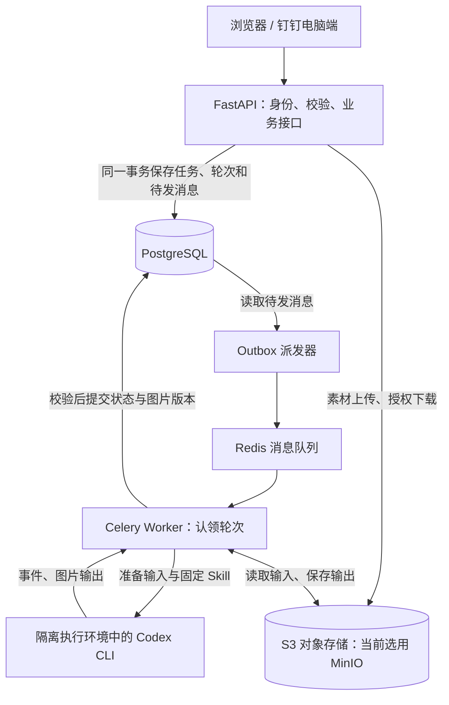

# 后端架构与风险评估

初次评估日期：2026-09-09，依据 Product-Spec v0.14、DEV-PLAN v1.10、Phase 5 源码与官方资料。同日用户确认会话生命周期及并发安全规则，本文跟踪说明同步至 Product-Spec v0.16 / DEV-PLAN v1.12；本次文档一致性修订没有将其他研究建议改为已选方案。

会话与并发安全规则已写入 Product-Spec 第 9.1–9.2 节、AC-021–025 及对应开发阶段；R3–R5 的设计缺口已有文档约束，代码和真实验收仍未完成。其他风险建议保持评估状态。Phase 5 已完成技术验证，Phase 6–14 尚未实现，不能把文档更新计为后端能力已通过。

架构方向可以保留：一个按业务模块组织的 FastAPI 应用，API、消息派发器、Celery Worker 分进程运行，PostgreSQL 管业务事实，S3 对象存储管文件，Codex CLI 由执行适配层调用。生产风险主要集中于存储组件、外部执行恢复、执行权限和会话持久化。

下面是后续落地后的链路。当前业务接口仅发布契约，尚未接入真实业务。

API 持久保存成功后即返回 202 和任务/轮次标识。页面通过 API 轮询数据库状态；关页面不会取消已受理任务。Redis 发布失败时，数据库中的待发消息仍可补发。依据：[异步执行设计](../../DEV-PLAN.md#3-技术栈和执行架构)。

后端业务模块按以下顺序接入已完成前端：

| 阶段 | 模块 | 核心责任 |
|---|---|---|
| 6 | 用户归属、文件 | 可信操作者、图片校验、私有上传、预览下载、逻辑删除记录 |
| 7 | 模板、Skill | 不可变模板版本、管理员安装与发布 Skill、冻结执行版本 |
| 8 | 任务、轮次、队列 | 三类业务提交、幂等、快照、认领、状态查询 |
| 9 | 执行适配、恢复、计量 | Linux CLI、指定会话、结果收集、异常对账、调用事实 |
| 10–11 | 返工、归档 | 同任务串行返工、按图片位置更新、不可变归档、下载与回收 |
| 12–13 | 真实认证、管理 | 钉钉双端身份、后端授权、统计、监控和配置 |
| 14 | 部署、验收 | HTTPS、备份恢复、真实 Skill 闭环、容量与双端验证 |

关键数据关系需要保持清楚：一个业务任务对应一个 Codex 会话；首次生成和每次返工各有一个轮次；每次实际启动 CLI 另记执行记录。图片按固定位置保存不可变版本，归档引用具体版本。任务创建者和实际返工操作者分别记录。依据：[数据模型](../../DEV-PLAN.md#6-数据模型分期)、[共享权限](../../Product-Spec.md#权限矩阵)。

风险按影响和处理时机列出。HIGH 表示在接入相应真实能力前应关闭；MEDIUM 表示需要明确实现与验收条件。

| 编号 | 等级 | 风险与影响 | 当前保护及处理阶段 |
|---|---|---|---|
| R1 | HIGH | 当前 MinIO 镜像落入官方安全公告受影响版本，社区仓库已停止维护。继续沿用会把已知风险带入真实文件服务。 | 当前只绑定本机端口；Phase 6 前重新评估生产存储与修复来源。 |
| R2 | HIGH | 真实 Skill、图像工具和服务器认证尚未验证，平台流程完成后仍可能无法产出业务图片。 | 已有 runner 适配设计；提前验证无效果要求的执行链路，真实 Skill 就绪后补最小业务冒烟。 |
| R3 | HIGH | AI 已执行但结果未入库时宕机，消息重投可能造成重复调用；当前测试行锁模式不能直接承担长时间外部调用。 | 已写入 PRD 9.2 与 Phase 8–9：内部状态、终态、认领、重试门禁及旧结果屏障；待实现验收。 |
| R4 | HIGH | 删除运行任务与 CLI 返回同时发生，可能删除后仍发布图片或继续占用执行名额。 | 已补 AC-023 和 Phase 8–9 的取消竞态验收；待实现。 |
| R5 | HIGH | 只保存会话 ID，容器重建后实际会话材料丢失，后续返工无法续接。 | 已补 PRD 9.1、AC-024、Phase 9/14 的持久化与重建恢复要求；待实测。 |
| R6 | HIGH | CLI/Skill 若继承 Worker 环境和权限，可接触数据库、存储凭据或其他任务文件。 | 当前进程非 root；Phase 6 拆分存储凭据，Phase 7–9 落实安装与执行隔离。 |
| R7 | MEDIUM | 对象上传、数据库提交与清理作业不在一个事务，可能出现孤儿文件或误删仍引用的图片。 | 计划已有暂存、确认、孤儿回收与引用保护；Phase 6 建模型，Phase 11 验证清理竞态。 |
| R8 | MEDIUM | 10 MiB 文件限制不能限制图片解码后的内存；多张图片、动画和 ZIP 处理可能耗尽资源。 | 已要求服务端解码和流式 ZIP；Phase 6/7/11 增加像素、帧数、解压量与进程资源边界。 |
| R9 | MEDIUM | 钉钉真实登录放在 Phase 12，企业身份映射、Cookie、下载回跳兼容性可能到后期才暴露。 | Phase 6 已规划先建可信身份接口；提早检查应用与域名条件，Phase 12 做双端实机验证。 |
| R10 | MEDIUM | 单机资源、执行耗时、账号用量与备份恢复未实测，20/100 用户目标不足以推导吞吐与可靠性。 | 已区分使用人数与执行并发；提早采集规格，Phase 9 记录真实耗时，Phase 14 验证容量和恢复。 |

R1 有明确的上游证据。[当前配置](D:/Work_Project/hengxin-smart-image/hengxin-smart-image/infra/compose.yaml:54)固定 `RELEASE.2025-09-07T16-13-09Z`。[官方公告 GHSA-hv4r-mvr4-25vw](https://github.com/minio/minio/security/advisories/GHSA-hv4r-mvr4-25vw)将该版本包含在受影响范围，涉及特定上传签名校验绕过，公告给出的修复属于 AIStor 版本。本轮进行了版本匹配，未实施漏洞利用，不能据此声称当前实例已被攻击。另有 [MinIO 官方仓库](https://github.com/minio/minio)在 2026-04-25 归档并明确不再维护。建议保持 S3 存储接口，评估有持续维护与明确修复渠道的实现；不能只把镜像改成 latest 就当作关闭风险。

R2 是项目可用性的关键依赖。[Spec 外部依赖](../../Product-Spec.md#9-agent-与外部依赖)明确三个真实 Skill、图像工具和 Linux CLI 认证尚待落实。本机 `codex --version` 为 0.153.4，`codex exec --help` 可确认非交互、JSONL 和 resume 入口；这只证明本机 CLI 命令能力。[OpenAI 非交互文档](https://learn.chatgpt.com/docs/non-interactive-mode)支持按会话 ID 续接，但不证明本项目的服务器、账号与图像工具组合可用。图片效果评测继续后置；运行能力至少要保留“真实可读图片落地、输出数量/位置可核验、一次同会话返工”的实机证据。若使用内置图像生成，还需计入共享 Codex 使用限额；具体供给与预算要以选定执行方式核实。[OpenAI 图像生成说明](https://learn.chatgpt.com/docs/image-generation)

R3 的现有证据是 [测试 Worker](D:/Work_Project/hengxin-smart-image/hengxin-smart-image/backend/app/worker/tasks.py:18)在数据库事务与行锁内执行短时、无外部副作用计算；[Celery 配置](D:/Work_Project/hengxin-smart-image/hengxin-smart-image/backend/app/worker/celery_app.py:13)的可见性超时为 60 秒；[派发器](D:/Work_Project/hengxin-smart-image/hengxin-smart-image/backend/app/worker/outbox.py:16)固定发送测试作业并持续重派未完成记录。这些符合当前测试阶段边界。后续需扩展作业类型和失败/取消终态，以短事务认领，事务外运行 CLI，提交结果时校验执行代次，拒绝失效执行者写回；同一业务任务的返工还要串行。消息传输重试、一次 CLI 内部调用和再次启动 CLI 必须分开处理。[Celery 官方文档](https://docs.celeryq.dev/en/stable/getting-started/backends-and-brokers/redis.html)说明消息可因可见性超时重投；调高超时不能独自解决重复外部调用。

初评指出内部不确定状态与重试资格尚未落实到传输契约。[执行设计](../../DEV-PLAN.md#phase-9codex-cli-独立会话与输出接入)已在本次更新中补充核实门禁，API-CONTRACT 并发补充确定 executionControl 及对应错误响应；[业务状态代码](D:/Work_Project/hengxin-smart-image/hengxin-smart-image/backend/app/contracts/business.py:8)与[调用状态代码](D:/Work_Project/hengxin-smart-image/hengxin-smart-image/backend/app/contracts/management.py:30)仍待后续阶段同步。实现时验证 CLI 启动后失联、输出已保存但数据库未提交和旧执行者晚返回；未确认旧执行停止前不能再次启动同轮次或同会话。

R4 来自 [删除接口契约](API-CONTRACT.md#会话与并发安全补充2026-09-09phase-810-待实现)与 [Phase 8](../../DEV-PLAN.md#phase-8任务提交持久队列与状态)、[Phase 9](../../DEV-PLAN.md#phase-9codex-cli-独立会话与输出接入)原有验收的差距；本次已将相关规则写入 PRD AC-023 与对应阶段。实施时把删除记录、取消请求和结果发布条件关联起来：排队删除后不启动；运行删除后终止执行进程树并核实退出；上传完成但尚未提交时删除，不得重新发布为可见结果。归档引用与执行事实保留。停止本地进程不能被表述为撤销上游已经受理的调用。

R5 原先缺少会话材料与临时工作目录的清晰边界。本次已在[会话计划](../../DEV-PLAN.md#phase-9codex-cli-独立会话与输出接入)与[存储设计](../../DEV-PLAN.md#6-数据模型分期)明确：临时轮次目录和持久会话材料分开，任务与会话唯一关联，每轮退出进程但保留必要会话材料，验收容器重建后的实际续接，具体清理天数仍未指定。不得对需要返工的任务使用不保留 session 文件的 ephemeral 模式；该行为见 [OpenAI 非交互文档](https://learn.chatgpt.com/docs/non-interactive-mode)。这些是已确认的实施要求，尚无项目实机恢复证据；恢复失败仍明确报错并保留旧图。

R6 有具体配置依据：[应用公共环境](D:/Work_Project/hengxin-smart-image/hengxin-smart-image/infra/compose.yaml:10)向 API、Worker 和派发器提供数据库及 MinIO 凭据，并与 [MinIO root 配置](D:/Work_Project/hengxin-smart-image/hengxin-smart-image/infra/compose.yaml:58)复用同一组变量。当前尚无 CLI 子进程，风险在未来直接继承环境时出现。建议使用按 bucket/操作授权的应用凭据，迁移账号与运行账号分开；runner 显式构造最小环境，不向 CLI 传递 PG/S3 管理凭据；Skill 版本目录只读、输出独立、网络与资源受控。目录命名只隔离文件布局，读写权限需要系统边界强制执行。参考 [OpenAI 环境变量策略](https://learn.chatgpt.com/docs/config-file/config-advanced)和[沙箱说明](https://learn.chatgpt.com/docs/sandboxing)。

R7 的原则已经写在 [数据存储设计](../../DEV-PLAN.md#6-数据模型分期)，需要具体事务和故障测试：上传成功但数据库失败产生可回收暂存对象；数据库记录已确认时图片必须可读取；新建归档与回收竞争时不得删除仍引用对象。图片版本使用新对象键，归档不能只保存可过期 URL。备份恢复必须同时核对数据库引用和对象内容。

R8 在 [Phase 6](../../DEV-PLAN.md#phase-6文件存储与用户归属基础)的“解码校验”基础上需要明确像素和帧数策略、请求流量限制及解码资源上限。[Pillow 官方安全文档](https://pillow.readthedocs.io/en/stable/handbook/security.html)说明小体积压缩图片可展开为大量内存；本评估未替产品指定新的尺寸上限。Skill ZIP 还应按现有计划拒绝越界路径、符号链接及解压超限；图片打包按 [Phase 11](../../DEV-PLAN.md#phase-11下载成品归档与生命周期)流式处理。

R9 不应通过改成“只能访问自己的任务”来解决。全员共享模板、任务和成品是[已确认规则](../../Product-Spec.md#权限矩阵)。应集中校验身份、账号状态、管理权限，记录实际操作者，并用两个入口验证同一企业成员映射同一用户。[双端设计](../../Product-Spec.md#钉钉双端登录)已考虑 state、可信成员映射和 Cookie；这些仍要靠实机测试。生产配置必须拒绝开发身份，队列结果和签名下载都不能相信客户端传入的角色。

R10 中执行并发 1、单轮 30 分钟、自动重跑 0、回收 30 天、RPO/RTO 等仍包含[待确认建议值](../../Product-Spec.md#11-尚需明确的事项)。仅作为容量例子：若每套耗时 10 分钟且执行并发 1，理论上限约每小时 6 套，尚未计下载上传与故障耗时；这不是当前实测值。需要分别测 API 并发、队列等待和真实图像执行资源；限制队列积压与执行尝试，日志和孤儿文件设清理边界，异机备份并做恢复演练。调用 usage 统计不能直接替代执行前的预算控制。

建议的处理顺序：

1. Phase 6 开工前处理存储版本与维护方案，明确文件状态、应用权限和上传资源边界。
2. Phase 7–8 按已同步的通用作业、轮次、取消、重试和结果提交契约实施，再将测试队列接入真实业务；重点验收多个用户和 Worker 的争用。
3. 将 CLI 运行能力和会话持久化的小规模验证提前安排；真实 Skill 效果评测继续按原计划后置。Phase 9 必须验证无重复启动、隔离和重建恢复。
4. 提早准备钉钉应用、域名与服务器规格；Phase 12/14 完成真实身份、业务及部署验收。

初次评估证据包括文档与源码阅读、本机 CLI 版本/帮助、官方维护状态与安全公告，以及独立 code-reviewer 对队列演进、取消和会话恢复的复核。后续会话并发确认仅更新需求、计划与契约文档，未执行真实 AI 调用、攻击测试或修改业务代码。

独立审查在限定范围内未发现属于 Phase 5 交付要求的 HIGH 缺陷；对后续演进提出的 HIGH 是启用相应真实能力前的验收条件。其无副作用编译输出为 `PASS: 25 Python source files compiled in memory; no imports, services, or files changed.`，退出码 0。该结果仅证明源码可编译，不替代真实执行、故障恢复或安全验证。

阶段总览中的 Phase 4/5 旧状态已与当前进度同步：Phase 1–4 已验收，Phase 5 技术验证通过待用户验收。会话并发设计的文档完成不改变 Phase 6–14 未开始的实现状态。

2026-09-09 并发隔离专项调研见 [Codex CLI 多任务并发与隔离评估](CODEX-CLI-ISOLATION-ASSESSMENT.md)：补充每轮独立容器、每任务独立状态存储的建议，说明共享登录凭据的刷新竞争，以及 20 人提交和实际生成并发的不同验收方法。该报告为开发前研究，未完成实际隔离或容量验证。
